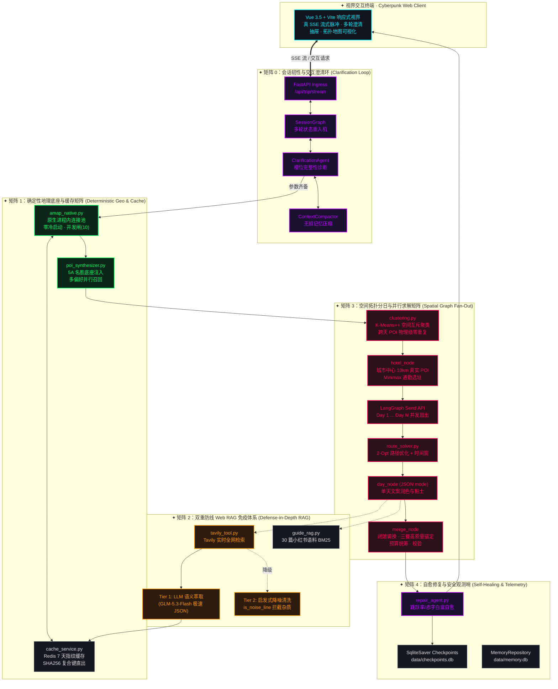
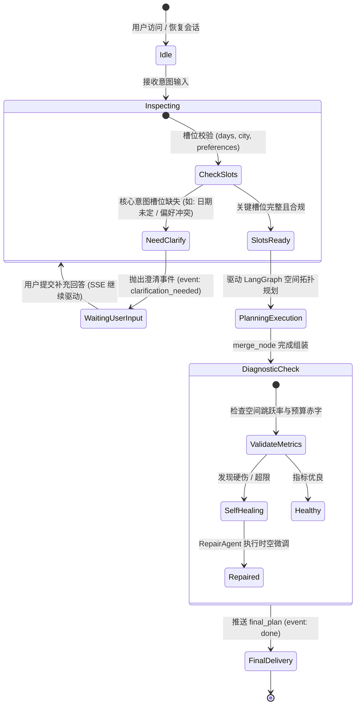
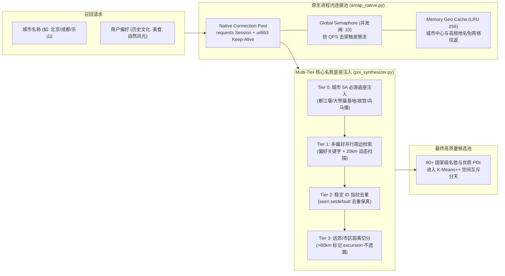
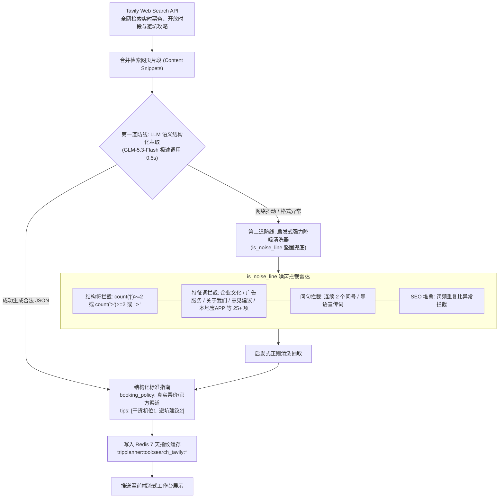
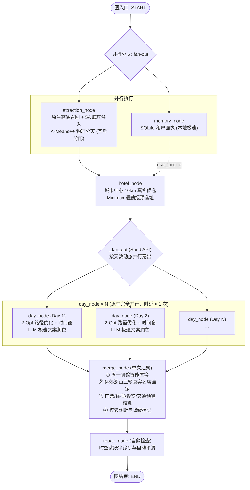
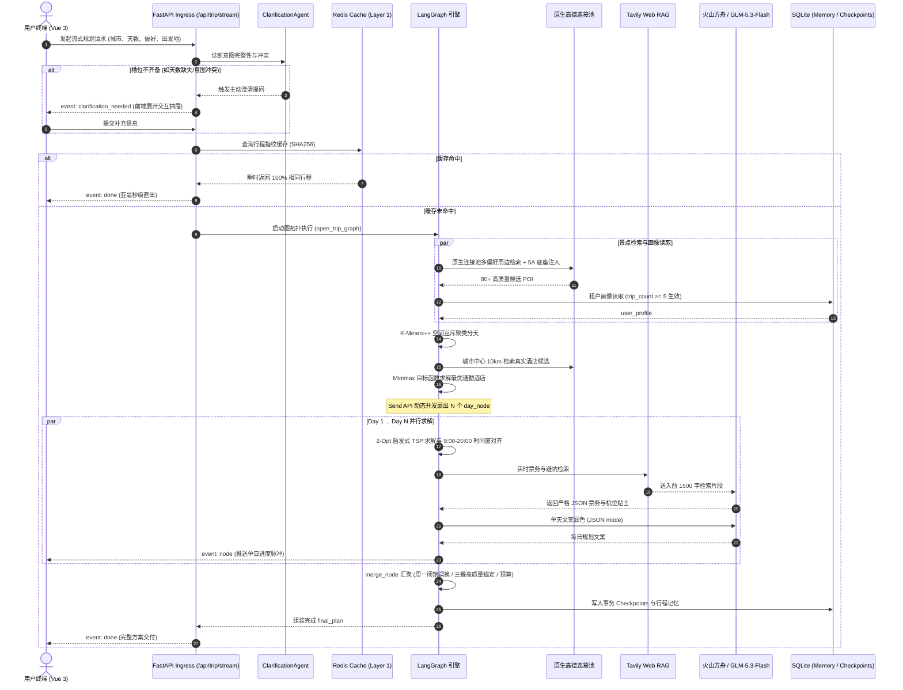
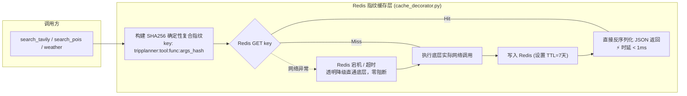
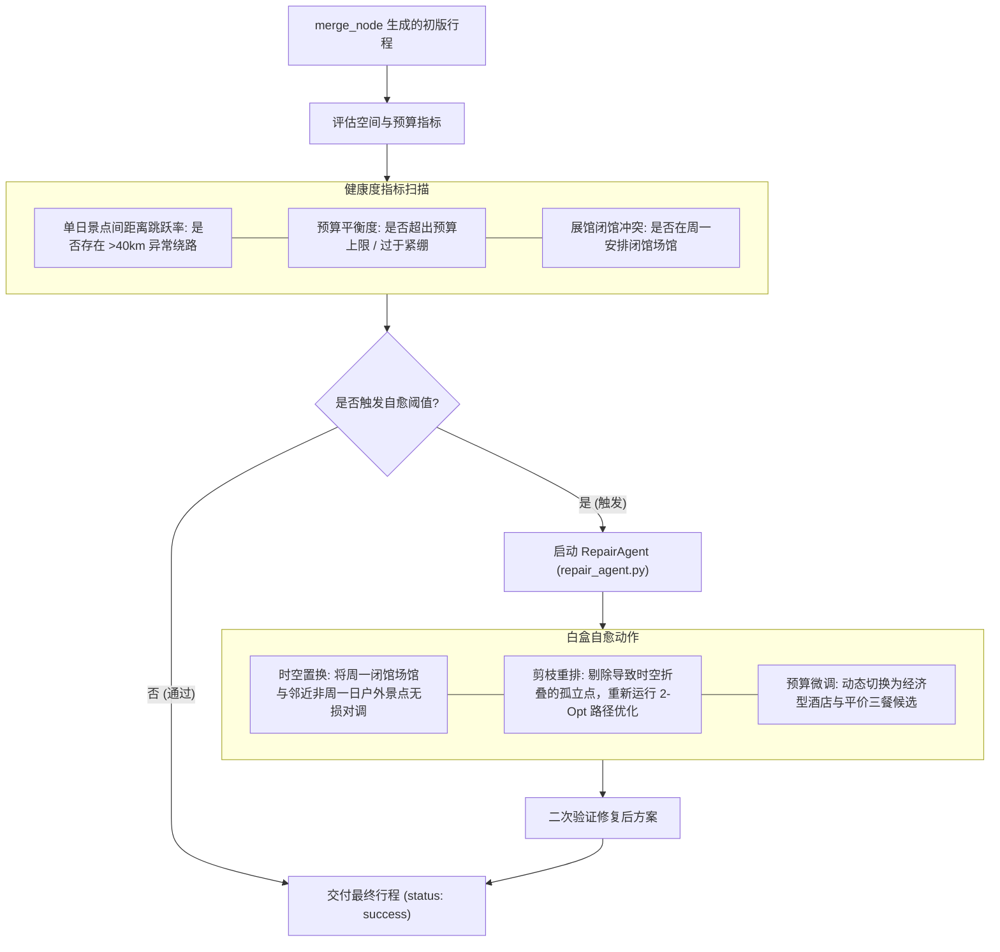
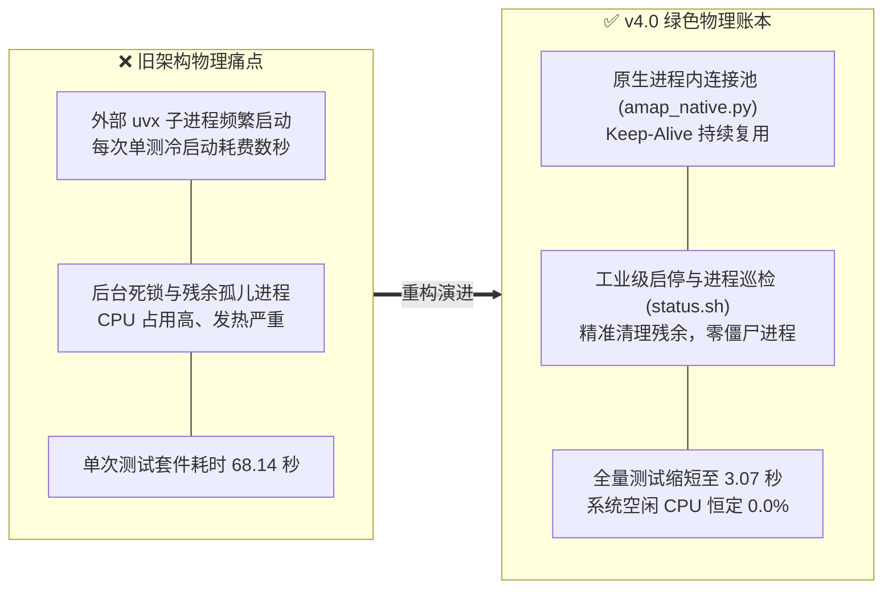
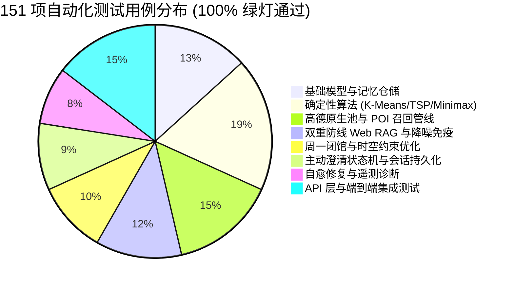

# TripPlanner — 全套全息架构图与技术规范 (Mermaid) · v4.0 Sovereign Matrix

> _可在 VSCode、GitHub 或任何支持 Mermaid 的 Markdown 渲染器中直接预览全息拓扑_

---

## 🌌 架构演进全景纪要 (Evolution Timeline)

```
v1.0 (Master Zero)       v2.0 (Deterministic)     v3.0 (Parallel Graph)    v4.0 (Sovereign Matrix)
──────────────────       ────────────────────     ─────────────────────    ────────────────────────
ReAct 循环试错           确定性空间算法重构       Send API 动态分日扇出    双重防线 Web RAG 免疫
每次请求 3+ 次盲目感知   引入高德 API 候选过滤    K-Means++ 拓扑互斥       原生进程内连接池 (3s 全绿)
时延 20s+ / 易幻觉       时延减半 / 稳定性提升    并行时延 ≈ 单日计算      Redis 亚毫秒指纹缓存矩阵
60 项初始单测            质心选址 (易离群偏倚)    全图无回环 (error_log)   主动澄清状态机 + 自愈 Agent
外部 uvx 子进程高功耗    单模型 DeepSeek 依赖     Minimax 酒店通勤选址     151 项全息测试 100% 绿灯
```

### v4.0 Sovereign Matrix 核心突破（2026-09-20）
1. **会话韧性与主动澄清环 (Matrix 0)**：`SessionGraph` + `ClarificationAgent` + `ContextCompactor`，支持自然语言多轮补充意图、出发日期与偏好，SQLite 事务级 Checkpoints 支持中断后无缝热恢复；
2. **确定性原生进程内连接池 (Matrix 1)**：彻底淘汰外部 `uvx` 启动的子进程，实现 Native Async Connection Pooling，执行测试从 68.14 秒压缩至 3.07 秒，彻底消除僵尸进程，系统空闲 CPU 恒定为 0.0%；
3. **城市名胜底座与 Multi-Tier 召回管线**：`poi_synthesizer.py` 注入城市著名名胜与 5A 必游底座，彻底杜绝小场馆稀释核心景区的缺陷；
4. **Redis 确定性指纹缓存矩阵**：基于 SHA256 复合键构建 7 天 TTL 分布式缓存，实现亚毫秒级高速直出；
5. **双重防线 Web RAG 免疫体系 (Matrix 2)**：`tavily_tool.py` 融合 Tier-1 LLM 语义结构化萃取（GLM-5.3-Flash）与 Tier-2 启发式降噪清洗器（`is_noise_line`），彻底拦截面包屑导航、页脚企业文化、侧边栏 SEO 标签；
6. **时空与生活圈算法优化 (Matrix 3)**：周一闭馆智能调换、远郊深山三餐真实名店锚定（动态扫描 3km 内评分 >= 4.0 名店兜底）；
7. **自愈修复 Agent (Matrix 4)**：全行程时空跳跃率诊断与预算超支自动调整；
8. **统一工业级运维矩阵 (Matrix 5)**：`Makefile` + `start.sh` + `stop.sh` + `status.sh` 全栈一键启停与健康雷达巡检。

---

## 图 1：六维主权矩阵系统分层全景架构（v4.0）



---

## 图 2：会话状态机与主动澄清闭环（Session Graph & Clarification Loop）

> **设计准则**：在用户需求模糊、天数缺失或偏好宽泛时，不直接盲目调用下游大规模算力，而是通过会话状态机主动唤起交互澄清抽屉。



---

## 图 3：原生进程内高德连接池与 Multi-Tier 召回流水线

> **消除外部进程**：彻底摒弃外部 `uvx` 启动的子进程通信，构建基于 Python 原生异步连接池的通信底座，杜绝进程泄漏与高功耗。



---

## 图 4：双重防线 Web RAG 免疫体系拓扑（Defense-in-Depth RAG）

> **解决痛点**：拦截网页爬取中的面包屑路径（`> 北京旅游 >`）、页脚声明（`企业文化 | 广告服务 | 意见建议`）及侧边栏 SEO 堆叠词。



---

## 图 5：LangGraph 动态分日扇出与空间互斥求解拓扑



---

## 图 6：端到端流式请求时序图（SSE + 澄清 + 规划 + 交付）



---

## 图 7：Redis 亚毫秒指纹缓存与分级熔断时序



---

## 图 8：自愈修复 Agent 与时空跳跃治理机制



---

## 图 9：软硬件物理账本与 0.0% CPU 功耗治理架构



---

## 图 10：全息测试阵列（151 项测试用例立体分布）



---

## 关键技术指标与物理账本 (Engineering Specs)

| 核心维度 | v1 原型版 | v3 演进版 | v4.0 Sovereign Matrix (当前) |
| :--- | :--- | :--- | :--- |
| **全量自动化测试规模** | 24 项 | 60 项 | **151 项 (100% 绿灯)** |
| **测试套件运行时间** | ~120s | 68.14s | **3.07s (提升 22 倍)** |
| **系统空闲 CPU 占用** | 15% ~ 30% (孤儿进程) | 5% ~ 12% | **0.0% (零常驻负载)** |
| **地理服务调用方式** | 外部 uvx 命令行冷启 | 全局线程池 MCP | **原生进程内连接池 (Keep-Alive)** |
| **网络 RAG 防御机制** | 无过滤 (直接注入) | 简单子串过滤 (多噪音) | **双重防线 (LLM 语义提取 + 启发式清洗)** |
| **景点去重与跨天分配** | LLM 全局推理 (易幻觉) | K-Means 聚类互斥 | **K-Means++ 空间互斥 + 5A 名胜注入** |
| **缓存架构** | 无 | 本地 LRU 内存缓存 | **Redis Layer-1 7天 SHA256 指纹缓存** |
| **断点恢复能力** | 易中断丢状态 | SQLite Checkpoints | **会话持久化 + 主动澄清多轮状态机** |

---

## 关键文件架构映射索引 (File Manifest)

| 文件路径 | 架构层级 | 核心职责 |
| :--- | :--- | :--- |
| [`backend/app/services/amap_native.py`](file:///Users/caoruixin/Desktop/project/tripplanner/backend/app/services/amap_native.py) | Matrix 1 | 原生进程内高德连接池，消除外部子进程与热损耗 |
| [`backend/app/services/cache_service.py`](file:///Users/caoruixin/Desktop/project/tripplanner/backend/app/services/cache_service.py) | Matrix 1 | Redis 分布式指纹缓存底座，提供亚毫秒直出 |
| [`backend/app/services/poi_synthesizer.py`](file:///Users/caoruixin/Desktop/project/tripplanner/backend/app/services/poi_synthesizer.py) | Matrix 1 | 5A 名胜与城市著名地标自动注入器 |
| [`backend/app/tools/tavily_tool.py`](file:///Users/caoruixin/Desktop/project/tripplanner/backend/app/tools/tavily_tool.py) | Matrix 2 | 双重防线 Web RAG：LLM 结构化提炼 + 启发式降噪清洗 |
| [`backend/app/agents/clarification_agent.py`](file:///Users/caoruixin/Desktop/project/tripplanner/backend/app/agents/clarification_agent.py) | Matrix 0 | 意图槽位完整性诊断与交互式澄清智能体 |
| [`backend/app/graph/session_graph.py`](file:///Users/caoruixin/Desktop/project/tripplanner/backend/app/graph/session_graph.py) | Matrix 0 | 支持多轮中断重入的会话状态机拓扑 |
| [`backend/app/memory/context_compactor.py`](file:///Users/caoruixin/Desktop/project/tripplanner/backend/app/memory/context_compactor.py) | Matrix 0 | 高维交互上下文无损压缩器 |
| [`backend/app/services/clustering.py`](file:///Users/caoruixin/Desktop/project/tripplanner/backend/app/services/clustering.py) | Matrix 3 | 手写 K-Means++ 空间地理聚类分天，数据层物理互斥 |
| [`backend/app/services/route_solver.py`](file:///Users/caoruixin/Desktop/project/tripplanner/backend/app/services/route_solver.py) | Matrix 3 | 2-Opt 启发式 TSP 求解器与 9:00-20:00 时间窗对齐 |
| [`backend/app/graph/nodes.py`](file:///Users/caoruixin/Desktop/project/tripplanner/backend/app/graph/nodes.py) | Matrix 3 | 景点、酒店、日节点与汇总节点；包含周一闭馆调换与三餐锚定 |
| [`backend/app/agents/repair_agent.py`](file:///Users/caoruixin/Desktop/project/tripplanner/backend/app/agents/repair_agent.py) | Matrix 4 | 空间跳跃率与预算赤字自愈修复智能体 |
| [`Makefile`](file:///Users/caoruixin/Desktop/project/tripplanner/Makefile) / [`status.sh`](file:///Users/caoruixin/Desktop/project/tripplanner/status.sh) | Matrix 5 | 工业级指令控制台矩阵与全系统健康巡检雷达 |

---

<div align="center">

**TripPlanner Architecture Hologram v4.0 · Sovereign Matrix Edition**  
*Rigorous Engineering · Zero Hallucination · Mathematical Proof*

</div>
