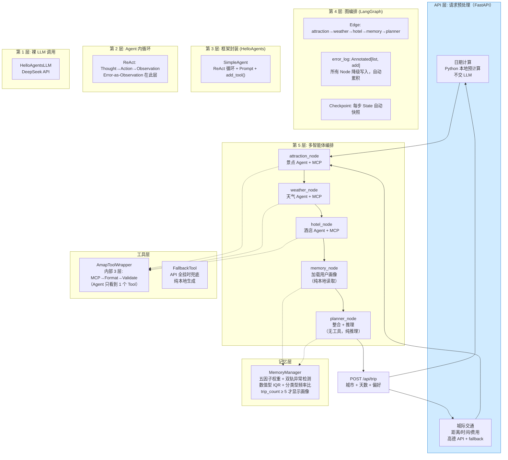
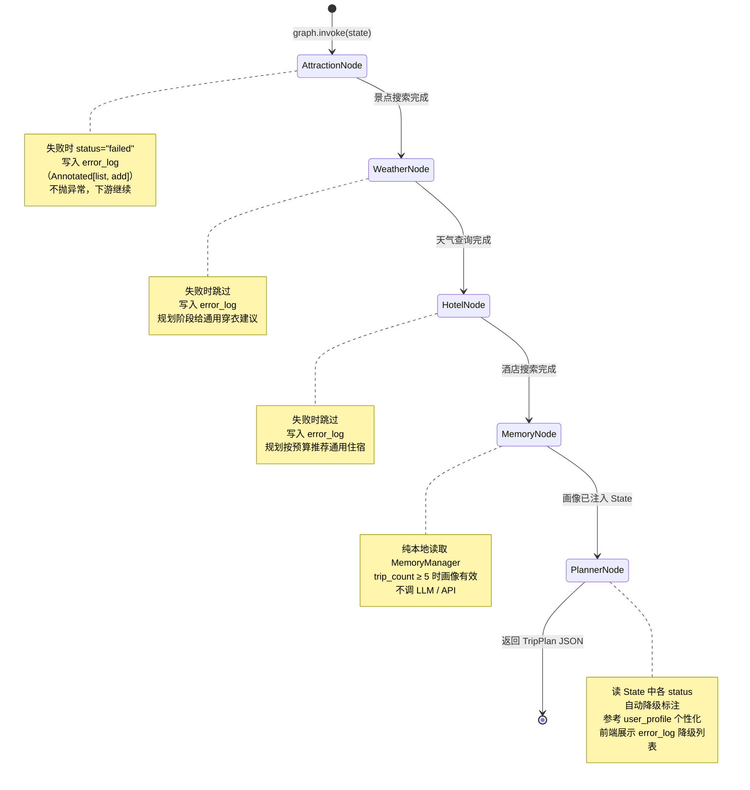
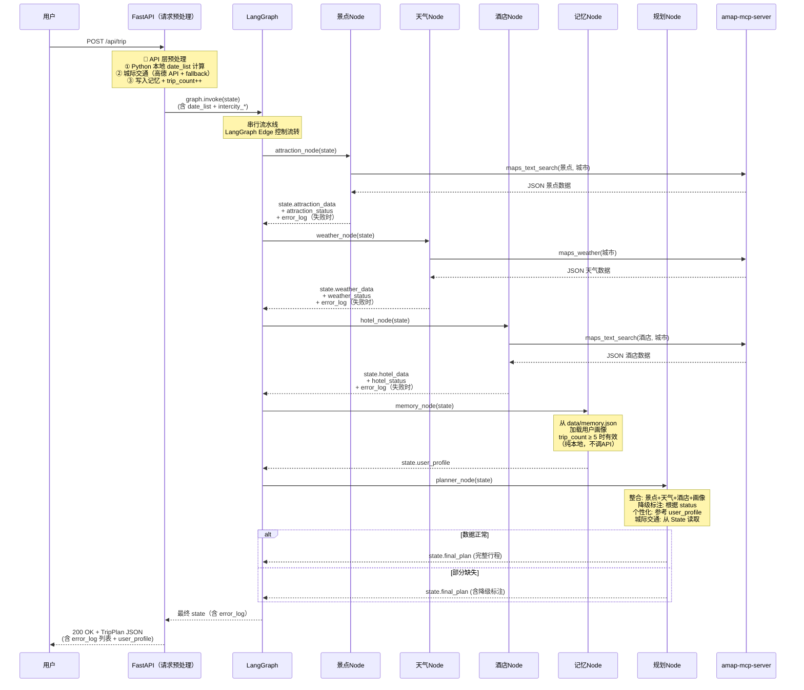
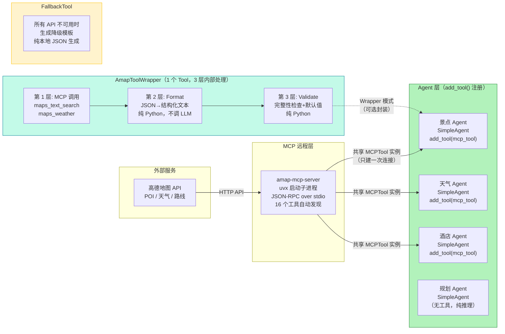
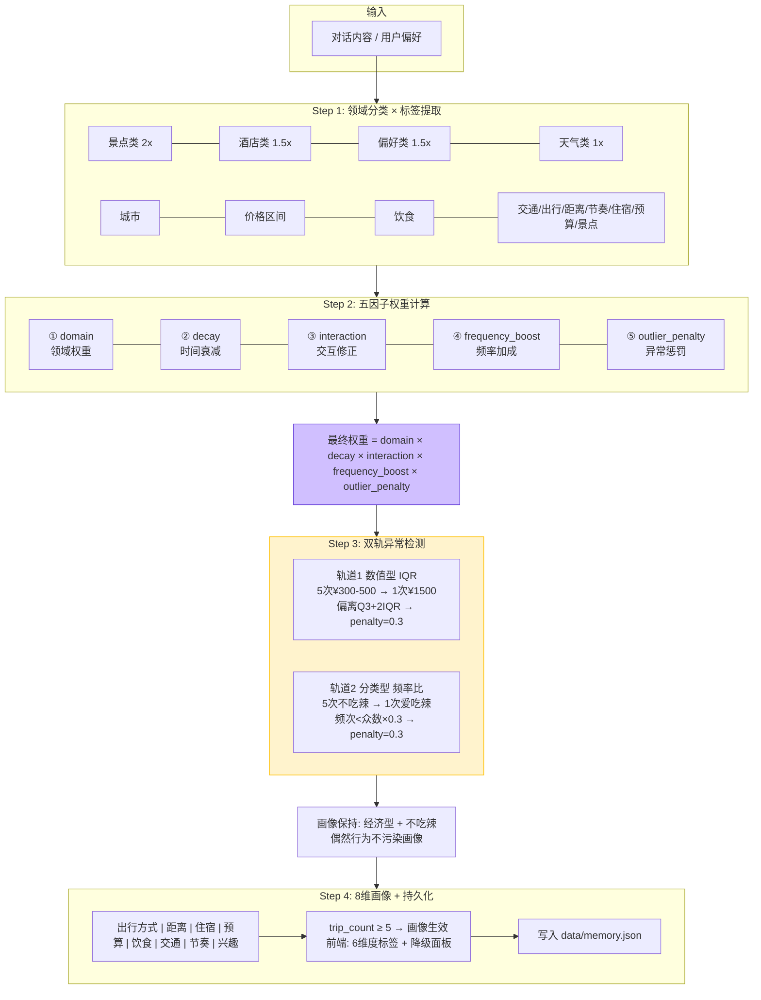
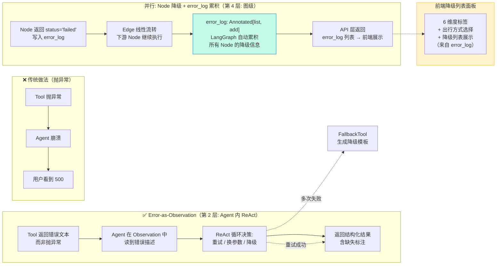
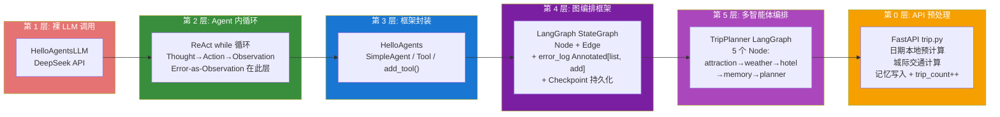

# TripPlanner — 全套架构图 (Mermaid)

_在 VSCode 中装 `Markdown Preview Mermaid Support` 插件后即可预览_

---

## 图 1：系统分层架构（5 层）

---

## 图 2：LangGraph 状态机流转（5 Node）

> 城际交通 + 日期计算在 **API 层预处理**，不在 LangGraph 图中。
> 图从 `graph.invoke(state)` 开始，此时 State 已含所有预处理数据。
> Agent 内部的 Error-as-Observation（第 2 层）见图 6。

---

## 图 3：请求数据流时序

---

## 图 4：工具架构 — Wrapper 模式 + add_tool() 注册

---

## 图 5：记忆模块 — 五因子权重 + 双轨异常检测

---

## 图 6：错误恢复 — 两层协同 + error_log 累积

> **图级** Conditional Routing（第 4 层）→ 见图 2。节点间路由，读 status 决定下一跳。
> **Agent 级** Error-as-Observation（第 2 层）→ 本图。Agent 内部处理工具调用失败。
> **累积机制** error_log: Annotated[list, add] — LangGraph 自动合并所有 Node 的降级信息。

---

## 图 7：架构分层映射 — 5 层定位

---

_定位: `/home/caoruixin/projects/tripplanner/ARCHITECTURE.md`_
_最后更新: 2026-07-20 — 与实际代码对齐_
