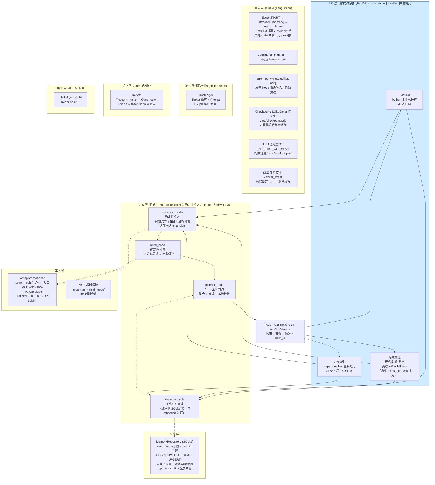
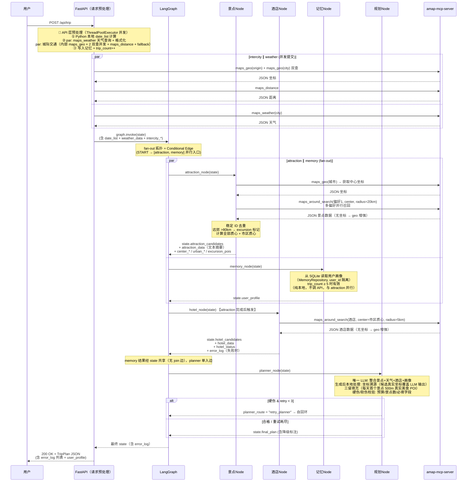
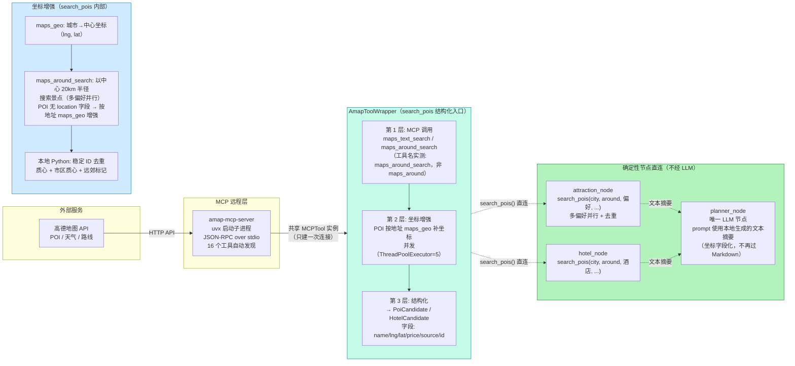
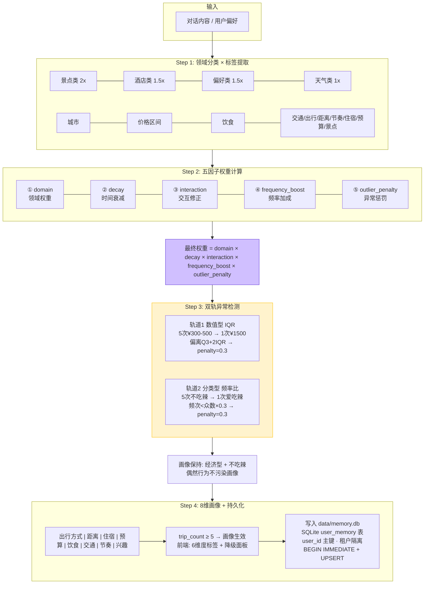
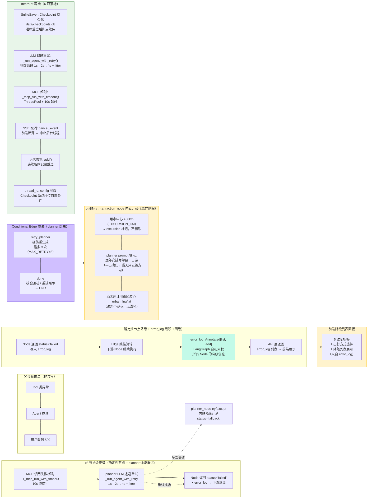
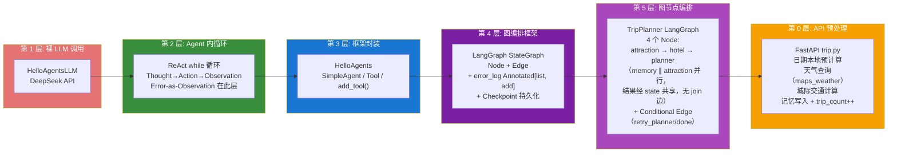

# TripPlanner — 全套架构图 (Mermaid)

_在 VSCode 中装 `Markdown Preview Mermaid Support` 插件后即可预览_

---

## 图 1：系统分层架构（5 层）

```mermaid
flowchart TB
    subgraph APILayer["API 层: 请求预处理（FastAPI）— intercity ∥ weather 并发提交"]
        direction LR
        PRE1["日期计算<br/>Python 本地预计算<br/>不交 LLM"]
        PRE2["城际交通<br/>距离/时间/费用<br/>高德 API + fallback<br/>（内部 maps_geo 双查并发）"]
        PRE3["天气查询<br/>maps_weather 直接调用<br/>格式化后注入 State"]
    end

    subgraph Layer5["第 5 层: 图节点（attraction/hotel 为确定性检索，planner 为唯一 LLM）"]
        direction LR
        N1["attraction_node<br/>确定性检索<br/>多偏好并行召回 + 坐标增强<br/>远郊标记 excursion"]
        N3["hotel_node<br/>确定性检索<br/>市区质心周边 5km 搜酒店"]
        N4["memory_node<br/>加载用户画像<br/>（纯本地 SQLite 读，与 attraction 并行）"]
        N5["planner_node<br/>唯一 LLM 节点<br/>整合 + 推理 + 本地校验"]
    end

    subgraph Layer4["第 4 层: 图编排 (LangGraph)"]
        EDGE["Edge: START → [attraction, memory] → hotel → planner<br/>（fan-out 拓扑，memory 结果经 state 共享，无 join 边）"]
        COND["Conditional: planner → retry_planner / done"]
        ERRLOG["error_log: Annotated[list, add]<br/>所有 Node 降级写入，自动累积"]
        CHECKPOINT["Checkpoint: SqliteSaver 持久化<br/>data/checkpoints.db<br/>进程重启后断点续传"]
        RETRY["LLM 退避重试: _run_agent_with_retry()<br/>指数退避 1s→2s→4s + jitter"]
        CANCEL["SSE 取消传播: cancel_event<br/>前端断开 → 中止后台线程"]
    end

    subgraph Layer3["第 3 层: 框架封装 (HelloAgents)"]
        AGENT["SimpleAgent<br/>ReAct 循环 + Prompt<br/>（仅 planner 使用）"]
    end

    subgraph Layer2["第 2 层: Agent 内循环"]
        REACT["ReAct: Thought→Action→Observation<br/>Error-as-Observation 在此层"]
    end

    subgraph Layer1["第 1 层: 裸 LLM 调用"]
        LLM["HelloAgentsLLM<br/>DeepSeek API"]
    end

    subgraph ToolLayer["工具层"]
        direction LR
        WRAPPER["AmapToolWrapper<br/>search_pois() 结构化入口<br/>MCP→坐标增强→PoiCandidate<br/>（确定性节点直连，不经 LLM）"]
        MCPTIMEOUT["MCP 超时保护<br/>_mcp_run_with_timeout()<br/>10s 超时兜底"]
    end

    subgraph MemoryLayer["记忆层"]
        MEMORY["MemoryRepository (SQLite)<br/>user_memory 表 · user_id 主键<br/>BEGIN IMMEDIATE 事务 + UPSERT<br/>五因子权重 + 双轨异常检测<br/>trip_count ≥ 5 才显示画像"]
    end

    USER["POST /api/trip 或 GET /api/trip/stream<br/>城市 + 天数 + 偏好 + user_id"] --> PRE1 & PRE2 & PRE3
    PRE1 & PRE2 & PRE3 --> N1 & N4
    N1 --> N3
    N3 --> N5
    N4 -.-> N5
    N5 --> USER

    N1 -.-> WRAPPER
    N3 -.-> WRAPPER
    N4 -.-> MEMORY

    style APILayer fill:#d0ebff,stroke:#1c7ed6
```

---

## 图 2：LangGraph 状态机流转（4 Node + fan-out + Conditional Edge）

> 城际交通 + 日期计算 + **天气查询**在 **API 层预处理**，不在 LangGraph 图中。
> 图从 `graph.invoke(state)` 开始，此时 State 已含所有预处理数据（天气/城际/日期）。
> **拓扑说明**：`START` fan-out 到 `AttractionNode` 和 `MemoryNode` 并行。`MemoryNode` 是纯本地 SQLite 读，结果经共享 state 传递（planner 读 `state["user_profile"]`）；`PlannerNode` 只有 `HotelNode` 单入边——**无 join 边**。实测 LangGraph 1.2.9 对跨 superstep 的 fan-in 是"每条入边各触发一次"而非 join，双入边会导致 planner 执行两次（LLM 调用双倍）。
> attraction/hotel 为确定性检索节点（直连 MCP，无 LLM）；LLM 只用于 planner（见图 6）。

```mermaid
stateDiagram-v2
    state fork_out <<fork>>

    [*] --> fork_out: graph.invoke(state)
    fork_out --> AttractionNode
    fork_out --> MemoryNode: 与 attraction 并行

    AttractionNode --> HotelNode: 检索完成 + 质心计算
    note right of AttractionNode: maps_geo 城市中心 → maps_around_search 20km<br/>多偏好并行召回 + 稳定 ID 去重<br/>远郊（>80km）标记 excursion（不删除）<br/>计算全部质心 + 市区质心<br/>失败时 status="failed"<br/>写入 error_log（Annotated[list, add]）

    HotelNode --> PlannerNode
    note right of HotelNode: 市区质心周边 5km 搜酒店（确定性）<br/>失败时退化全城搜索<br/>写入 error_log

    MemoryNode --> PlannerNode: 结果经 state 共享（无 join 边）
    note right of MemoryNode: 纯本地 SQLite 读（MemoryRepository）<br/>trip_count ≥ 5 时画像有效<br/>不调 LLM / API<br/>与 attraction 并行执行

    PlannerNode --> PlannerNode: retry_planner（硬伤重生成, 最多 3 次）
    PlannerNode --> [*]: done → 返回 TripPlan JSON
    note right of PlannerNode: 唯一 LLM 节点<br/>生成后本地处理: 坐标溯源（候选真实坐标覆盖）<br/>三餐填充（景点周边 500m 真实美食 POI）<br/>硬伤/软伤校验 → retry_planner / done
```

---

## 图 3：请求数据流时序

```mermaid
sequenceDiagram
    participant User as 用户
    participant API as FastAPI（请求预处理）
    participant Graph as LangGraph
    participant Attr as 景点Node
    participant Hotel as 酒店Node
    participant Mem as 记忆Node
    participant Plan as 规划Node
    participant MCP as amap-mcp-server

    User->>API: POST /api/trip

    Note over API: 🔧 API 层预处理（ThreadPoolExecutor 并发）<br/>① Python 本地 date_list 计算<br/>② par: maps_weather 天气查询 + 格式化<br/>   par: 城际交通（内部 maps_geo × 2 双查并发 + maps_distance + fallback）<br/>③ 写入记忆 + trip_count++

    par intercity ∥ weather (并发提交)
        API->>MCP: maps_geo(origin) + maps_geo(city) 双查
        MCP-->>API: JSON 坐标
        API->>MCP: maps_distance
        MCP-->>API: JSON 距离
    and
        API->>MCP: maps_weather(city)
        MCP-->>API: JSON 天气
    end

    API->>Graph: graph.invoke(state)<br/>(含 date_list + weather_data + intercity_*)

    Note over Graph: fan-out 拓扑 + Conditional Edge<br/>(START → [attraction, memory] 并行入口)

    par attraction ∥ memory (fan-out)
        Graph->>Attr: attraction_node(state)
        Attr->>MCP: maps_geo(城市) → 获取中心坐标
        MCP-->>Attr: JSON 坐标
        Attr->>MCP: maps_around_search(偏好1, center, radius=20km)<br/>多偏好并行召回
        MCP-->>Attr: JSON 景点数据（无坐标 → geo 增强）
        Note over Attr: 稳定 ID 去重<br/>远郊 >80km → excursion 标记<br/>计算全部质心 + 市区质心
        Attr-->>Graph: state.attraction_candidates<br/>+ attraction_data（文本摘要）<br/>+ center_* / urban_* / excursion_pois
    and
        Graph->>Mem: memory_node(state)
        Note over Mem: 从 SQLite 读取用户画像<br/>（MemoryRepository, user_id 隔离）<br/>trip_count ≥ 5 时有效<br/>（纯本地，不调 API，与 attraction 并行）
        Mem-->>Graph: state.user_profile
    end

    Graph->>Hotel: hotel_node(state)  【attraction 完成后触发】
    Hotel->>MCP: maps_around_search(酒店, center=市区质心, radius=5km)
    MCP-->>Hotel: JSON 酒店数据（无坐标 → geo 增强）
    Hotel-->>Graph: state.hotel_candidates<br/>+ hotel_data<br/>+ hotel_status<br/>+ error_log（失败时）

    Note over Graph: memory 结果经 state 共享（无 join 边），planner 单入边
    Graph->>Plan: planner_node(state)
    Note over Plan: 唯一 LLM: 整合景点+天气+酒店+画像<br/>生成后本地处理: 坐标溯源（候选真实坐标覆盖 LLM 输出）<br/>三餐填充（每天首个景点 500m 真实美食 POI）<br/>硬伤/软伤校验: 预算/景点数/必填字段

    alt 硬伤 & retry < 3
        Plan-->>Graph: planner_route = "retry_planner" → 自回环
    else 合格 / 重试耗尽
        Plan-->>Graph: state.final_plan (含降级标注)
    end

    Graph-->>API: 最终 state（含 error_log）
    API-->>User: 200 OK + TripPlan JSON<br/>(含 error_log 列表 + user_profile)
```

---

## 图 4：工具架构 — Wrapper 结构化入口 + 坐标增强（确定性节点直连）

```mermaid
flowchart LR
    subgraph External["外部服务"]
        AMAP["高德地图 API<br/>POI / 天气 / 路线"]
    end

    subgraph MCPLayer["MCP 远程层"]
        MCPSRV["amap-mcp-server<br/>uvx 启动子进程<br/>JSON-RPC over stdio<br/>16 个工具自动发现"]
    end

    subgraph GeoEnhance["坐标增强（search_pois 内部）"]
        direction TB
        GEO1["maps_geo: 城市→中心坐标<br/>（lng, lat）"]
        GEO2["maps_around_search: 以中心 20km 半径<br/>搜索景点（多偏好并行）<br/>POI 无 location 字段 → 按地址 maps_geo 增强"]
        GEO3["本地 Python: 稳定 ID 去重<br/>质心 + 市区质心 + 远郊标记"]
        GEO1 --> GEO2 --> GEO3
    end

    subgraph WrapperLayer["AmapToolWrapper（search_pois 结构化入口）"]
        direction TB
        L1["第 1 层: MCP 调用<br/>maps_text_search / maps_around_search<br/>（工具名实测: maps_around_search，非 maps_around）"]
        L2["第 2 层: 坐标增强<br/>POI 按地址 maps_geo 补坐标<br/>并发（ThreadPoolExecutor=5）"]
        L3["第 3 层: 结构化<br/>→ PoiCandidate / HotelCandidate<br/>字段: name/lng/lat/price/source/id"]
        L1 --> L2 --> L3
    end

    subgraph NodeLayer["确定性节点直连（不经 LLM）"]
        direction TB
        A1["attraction_node<br/>search_pois(city, around, 偏好, ...)<br/>多偏好并行 + 去重"]
        A3["hotel_node<br/>search_pois(city, around, 酒店, ...)"]
        A4["planner_node<br/>唯一 LLM 节点<br/>prompt 使用本地生成的文本摘要<br/>（坐标字段化，不再过 Markdown）"]
    end

    AMAP -->|"HTTP API"| MCPSRV
    MCPSRV -->|"共享 MCPTool 实例<br/>（只建一次连接）"| WrapperLayer
    WrapperLayer -.->|"search_pois() 直连"| A1
    WrapperLayer -.->|"search_pois() 直连"| A3
    A1 -.->|"文本摘要"| A4
    A3 -.->|"文本摘要"| A4

    style GeoEnhance fill:#d0ebff,stroke:#1c7ed6
    style WrapperLayer fill:#c3fae8,stroke:#0c8599
    style NodeLayer fill:#b2f2bb,stroke:#2b8a3e
```

---

## 图 5：记忆模块 — 五因子权重 + 双轨异常检测

```mermaid
flowchart TB
    subgraph Input["输入"]
        DIALOG["对话内容 / 用户偏好"]
    end

    subgraph Step1["Step 1: 领域分类 × 标签提取"]
        direction LR
        C1["景点类 2x"] --- C2["酒店类 1.5x"] --- C3["偏好类 1.5x"] --- C4["天气类 1x"]
        T1["城市"] --- T2["价格区间"] --- T3["饮食"] --- T4["交通/出行/距离/节奏/住宿/预算/景点"]
    end

    subgraph Step2["Step 2: 五因子权重计算"]
        direction LR
        F1["① domain<br/>领域权重"] --- F2["② decay<br/>时间衰减"] --- F3["③ interaction<br/>交互修正"] --- F4["④ frequency_boost<br/>频率加成"] --- F5["⑤ outlier_penalty<br/>异常惩罚"]
    end

    FORMULA["最终权重 = domain × decay × interaction × frequency_boost × outlier_penalty"]

    subgraph Step3["Step 3: 双轨异常检测"]
        direction LR
        T1A["轨道1 数值型 IQR<br/>5次¥300-500 → 1次¥1500<br/>偏离Q3+2IQR → penalty=0.3"]
        T2A["轨道2 分类型 频率比<br/>5次不吃辣 → 1次爱吃辣<br/>频次<众数×0.3 → penalty=0.3"]
    end

    RESULT["画像保持: 经济型 + 不吃辣<br/>偶然行为不污染画像"]

    subgraph Step4["Step 4: 8维画像 + 持久化"]
        DIMS["出行方式 | 距离 | 住宿 | 预算 | 饮食 | 交通 | 节奏 | 兴趣"]
        GATE["trip_count ≥ 5 → 画像生效<br/>前端: 6维度标签 + 降级面板"]
        STORE["写入 data/memory.db<br/>SQLite user_memory 表<br/>user_id 主键 · 租户隔离<br/>BEGIN IMMEDIATE + UPSERT"]
    end

    DIALOG --> Step1
    Step1 --> Step2
    Step2 --> FORMULA
    FORMULA --> Step3
    Step3 --> RESULT
    RESULT --> Step4
    DIMS --> GATE --> STORE

    style Step3 fill:#fff3cd,stroke:#ffc107
    style FORMULA fill:#d0bfff,stroke:#6741d9
```

---

## 图 6：错误恢复 — 三层协同 + error_log 累积 + Conditional Edge 重试 + Interrupt 容错

> **图级** Conditional Routing（第 4 层）→ 见图 2。planner 执行后根据 `_validate_and_refine()` 结果路由。
> **图级降级** 确定性节点（attraction/hotel）失败 → status="failed" + error_log，不抛异常，planner 用降级数据继续。
> **累积机制** error_log: Annotated[list, add] — LangGraph 自动合并所有 Node 的降级信息。
> **重试上限** planner 硬伤最多重试 3 次（MAX_RETRY）；离群不再触发 hotel 回环（远郊 → excursion 标记）。
> **Interrupt 容错** SqliteSaver 持久化 + LLM 退避重试 + MCP 超时 + SSE 取消传播 + 记忆去重。
> **planner 异常兜底** try/except → 内联 fallback plan（status="fallback"），不返回 500。

```mermaid
flowchart LR
    subgraph Bad["❌ 传统做法（抛异常）"]
        ERR["Tool 抛异常"]
        CRASH["Agent 崩溃"]
        USERERR["用户看到 500"]
        ERR --> CRASH --> USERERR
    end

    subgraph Good["✅ 节点级降级（确定性节点 + planner 退避重试）"]
        OBS["MCP 调用失败/超时<br/>（_mcp_run_with_timeout 10s 兜底）"]
        RETRY["planner LLM 退避重试<br/>_run_agent_with_retry<br/>1s→2s→4s + jitter"]
        DONE["Node 返回 status='failed'<br/>+ error_log → 下游继续"]
        OBS --> RETRY --> DONE
    end

    subgraph GraphLayer["确定性节点降级 + error_log 累积（图级）"]
        GFAIL["Node 返回 status='failed'<br/>写入 error_log"]
        GEDGE["Edge 线性流转<br/>下游 Node 继续执行"]
        ACCUM["error_log: Annotated[list, add]<br/>LangGraph 自动累积<br/>所有 Node 的降级信息"]
        API_RET["API 层返回<br/>error_log 列表 → 前端展示"]
        GFAIL --> GEDGE --> ACCUM --> API_RET
    end

    subgraph CondRetry["Conditional Edge 重试（planner 路由）"]
        direction TB
        CR1["retry_planner<br/>硬伤重生成<br/>最多 3 次（MAX_RETRY=3）"]
        CR3["done<br/>校验通过 / 重试耗尽<br/>→ END"]
        CR1 --- CR3
    end

    subgraph ExcursionMark["远郊标记（attraction_node 内置，替代离群删除）"]
        direction TB
        OD1["距市中心 >80km（EXCURSION_KM）<br/>→ excursion 标记，不删除"]
        OD2["planner prompt 提示:<br/>远郊安排为单独一日游<br/>（早出晚归，当天只去该方向）"]
        OD3["酒店选址用市区质心 urban_lng/lat<br/>（远郊不参与，无回环）"]
        OD1 --- OD2 --- OD3
    end

    subgraph InterruptResilient["Interrupt 容错（6 项落地）"]
        direction TB
        IR1["SqliteSaver: Checkpoint 持久化<br/>data/checkpoints.db<br/>进程重启后断点续传"]
        IR2["LLM 退避重试: _run_agent_with_retry()<br/>指数退避 1s→2s→4s + jitter"]
        IR3["MCP 超时: _mcp_run_with_timeout()<br/>ThreadPool + 10s 超时"]
        IR4["SSE 取消: cancel_event<br/>前端断开 → 中止后台线程"]
        IR5["记忆去重: add()<br/>连续相同记录跳过"]
        IR6["thread_id: config 参数<br/>Checkpoint 断点续传前置条件"]
        IR1 --- IR2 --- IR3 --- IR4 --- IR5 --- IR6
    end

    subgraph FallbackPanel["前端降级列表面板"]
        FP["6 维度标签<br/>+ 出行方式选择<br/>+ 降级列表展示<br/>（来自 error_log）"]
    end

    RETRY -.->|"重试成功"| DONE
    RETRY -.->|"多次失败"| FALLBACK_PLAN["planner_node try/except<br/>内联降级计划<br/>status='fallback'"]
    API_RET -.-> FP
    CondRetry -.-> ExcursionMark

    style ACCUM fill:#c3fae8,stroke:#0c8599
    style CondRetry fill:#d0bfff,stroke:#6741d9
    style ExcursionMark fill:#fff3cd,stroke:#ffc107
    style InterruptResilient fill:#e8f5e9,stroke:#2e7d32
    style FallbackPanel fill:#fff3cd,stroke:#ffc107
```

---

## 图 7：架构分层映射 — 5 层定位

```mermaid
flowchart LR
    subgraph L5["第 5 层: 图节点编排"]
        direction TB
        N5["TripPlanner LangGraph<br/>4 个 Node:<br/>attraction → hotel → planner<br/>（memory ∥ attraction 并行，<br/>结果经 state 共享，无 join 边）<br/>+ Conditional Edge（retry_planner/done）"]
    end

    subgraph L4["第 4 层: 图编排框架"]
        direction TB
        N4["LangGraph StateGraph<br/>Node + Edge<br/>+ error_log Annotated[list, add]<br/>+ Checkpoint 持久化"]
    end

    subgraph L3["第 3 层: 框架封装"]
        direction TB
        N3["HelloAgents<br/>SimpleAgent / Tool / add_tool()"]
    end

    subgraph L2["第 2 层: Agent 内循环"]
        direction TB
        N2["ReAct while 循环<br/>Thought→Action→Observation<br/>Error-as-Observation 在此层"]
    end

    subgraph L1["第 1 层: 裸 LLM 调用"]
        direction TB
        N1["HelloAgentsLLM<br/>DeepSeek API"]
    end

    subgraph L0["第 0 层: API 预处理"]
        direction TB
        N0["FastAPI trip.py<br/>日期本地预计算<br/>天气查询（maps_weather）<br/>城际交通计算<br/>记忆写入 + trip_count++"]
    end

    N1 --> N2 --> N3 --> N4 --> N5 --> N0

    style L5 fill:#ab47bc,color:#fff
    style L4 fill:#7b1fa2,color:#fff
    style L3 fill:#1976d2,color:#fff
    style L2 fill:#388e3c,color:#fff
    style L1 fill:#e57373,color:#fff
    style L0 fill:#f59f00,color:#fff
```

---

_定位: `/home/caoruixin/projects/tripplanner/ARCHITECTURE.md`_
_最后更新: 2026-08-21 — 结构化候选链路重构（确定性节点替代伪 Agent、多偏好召回、远郊 excursion、市区质心选址、坐标溯源、真实三餐）、无 join 边拓扑（LangGraph fan-in 实测）、SSE 真流式前端、GET stream 参数校验、测试基线 42 用例_
