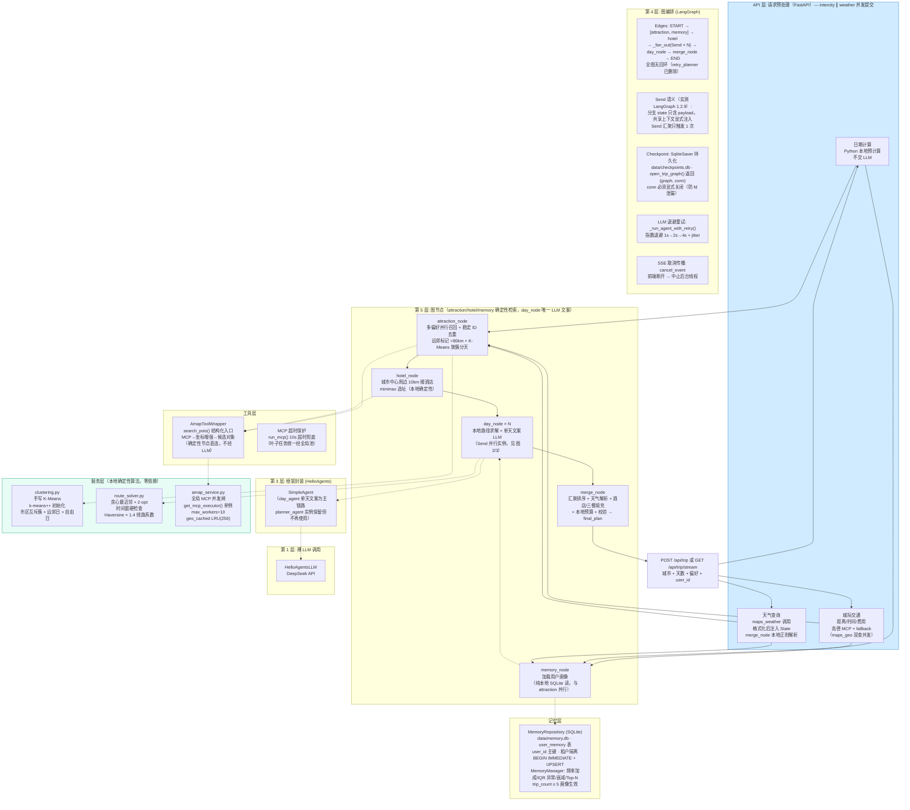
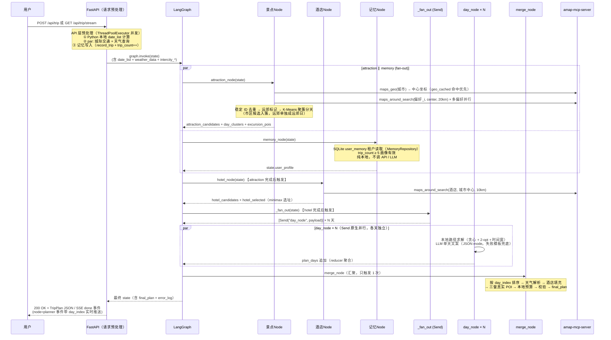
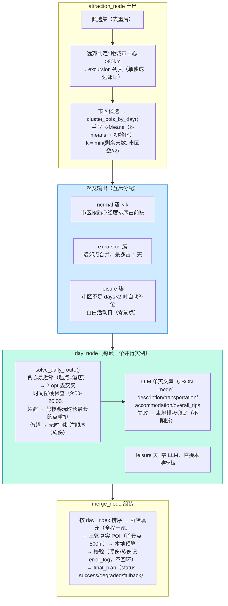
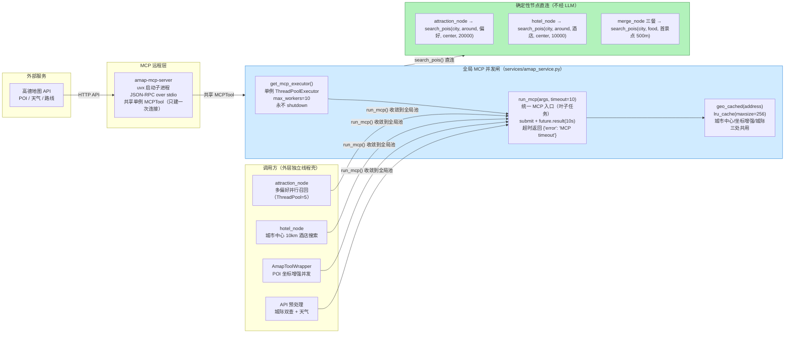
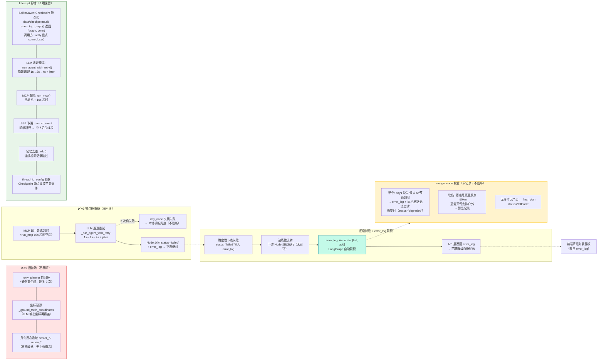

# TripPlanner — 全套架构图 (Mermaid) · v3

_在 VSCode 中装 `Markdown Preview Mermaid Support` 插件后即可预览_

**v3 核心变化（2026-08-21）**：
- 拓扑重构：`START → [attraction, memory] → hotel → _fan_out → day_node × N → merge_node → END`，**全图无回环**（v2 的 retry_planner 自回环已删除）
- 分日并发：`_fan_out` 用 LangGraph **Send API** 按天动态 fan-out，`day_node × N` 原生并行，`merge_node` 汇聚（实测只触发 1 次）
- 数据层互斥：景点按天分配由 **K-Means 聚簇**保证（`services/clustering.py`，k-means++ 初始化），LLM 不再做全局去重
- 本地求解：日内路径 = 贪心最近邻 + 2-opt + 时间窗硬检查（`services/route_solver.py`，Haversine × 绕路系数 1.4）；LLM 只写单天文案（JSON mode，失败本地模板兜底；leisure 天零 LLM）
- 已删除：`center_lng/center_lat/urban_lng/urban_lat` 质心字段、坐标溯源函数 `_ground_truth_coordinates`（LLM 不输出坐标，幻觉源在结构上消除）、retry_planner 回环
- 酒店选址：`_select_hotel` **minimax 通勤距离**（远郊点排除，经济型偏好前置过滤），搜索中心 = 城市中心 geocode（替代几何质心），半径 10km

---

## 图 1：系统分层架构（v3）

```mermaid
flowchart TB
    subgraph APILayer["API 层: 请求预处理（FastAPI）— intercity ∥ weather 并发提交"]
        direction LR
        PRE1["日期计算<br/>Python 本地预计算<br/>不交 LLM"]
        PRE2["城际交通<br/>距离/时间/费用<br/>高德 MCP + fallback<br/>（maps_geo 双查并发）"]
        PRE3["天气查询<br/>maps_weather 调用<br/>格式化后注入 State<br/>merge_node 本地正则解析"]
    end

    subgraph Layer5["第 5 层: 图节点（attraction/hotel/memory 确定性检索，day_node 唯一 LLM 文案）"]
        direction LR
        N1["attraction_node<br/>多偏好并行召回 + 稳定 ID 去重<br/>远郊标记 >80km + K-Means 聚簇分天"]
        N3["hotel_node<br/>城市中心周边 10km 搜酒店<br/>minimax 选址（本地确定性）"]
        N4["memory_node<br/>加载用户画像<br/>（纯本地 SQLite 读，与 attraction 并行）"]
        N5["day_node × N<br/>本地路径求解 + 单天文案 LLM<br/>（Send 并行实例，见 图 2/3）"]
        N6["merge_node<br/>汇聚排序 + 天气解析 + 酒店/三餐填充<br/>+ 本地预算 + 校验 → final_plan"]
    end

    subgraph Layer4["第 4 层: 图编排 (LangGraph)"]
        EDGE["Edges: START → [attraction, memory] → hotel<br/>→ _fan_out(Send × N) → day_node → merge_node → END<br/>全图无回环（retry_planner 已删除）"]
        SEND["Send 语义（实测 LangGraph 1.2.9）:<br/>分支 state 只含 payload，共享上下文显式注入<br/>Send 汇聚只触发 1 次"]
        CHECKPOINT["Checkpoint: SqliteSaver 持久化<br/>data/checkpoints.db · open_trip_graph() 返回 (graph, conn)<br/>conn 必须显式关闭（防 fd 泄漏）"]
        RETRY["LLM 退避重试: _run_agent_with_retry()<br/>指数退避 1s→2s→4s + jitter"]
        CANCEL["SSE 取消传播: cancel_event<br/>前端断开 → 中止后台线程"]
    end

    subgraph Layer3["第 3 层: 框架封装 (HelloAgents)"]
        AGENT["SimpleAgent<br/>（day_agent 单天文案为主链路<br/>planner_agent 实例保留但不再使用）"]
    end

    subgraph Layer1["第 1 层: 裸 LLM 调用"]
        LLM["HelloAgentsLLM<br/>DeepSeek API"]
    end

    subgraph ServiceLayer["服务层（本地确定性算法，零依赖）"]
        direction LR
        S1["clustering.py<br/>手写 K-Means<br/>k-means++ 初始化<br/>市区互斥簇 + 远郊日 + 自由日"]
        S2["route_solver.py<br/>贪心最近邻 + 2-opt<br/>时间窗硬检查<br/>Haversine × 1.4 绕路系数"]
        S3["amap_service.py<br/>全局 MCP 并发闸<br/>get_mcp_executor() 单例<br/>max_workers=10<br/>geo_cached LRU(256)"]
    end

    subgraph ToolLayer["工具层"]
        direction LR
        WRAPPER["AmapToolWrapper<br/>search_pois() 结构化入口<br/>MCP→坐标增强→候选对象<br/>（确定性节点直连，不经 LLM）"]
        MCPTIMEOUT["MCP 超时保护<br/>run_mcp() 10s 超时兜底<br/>（叶子任务统一经全局池）"]
    end

    subgraph MemoryLayer["记忆层"]
        MEMORY["MemoryRepository (SQLite)<br/>data/memory.db · user_memory 表<br/>user_id 主键 · 租户隔离<br/>BEGIN IMMEDIATE + UPSERT<br/>MemoryManager: 频率加成/IQR 异常/衰减/Top-N<br/>trip_count ≥ 5 画像生效"]
    end

    USER["POST /api/trip 或 GET /api/trip/stream<br/>城市 + 天数 + 偏好 + user_id"] --> PRE1 & PRE2 & PRE3
    PRE1 & PRE2 & PRE3 --> N1 & N4
    N1 --> N3
    N3 --> N5
    N4 -.-> N5
    N5 --> N6
    N6 --> USER

    N1 -.-> WRAPPER
    N3 -.-> WRAPPER
    N4 -.-> MEMORY
    N5 -.-> AGENT
    AGENT -.-> LLM
    N1 -.-> S1
    N5 -.-> S2
    WRAPPER -.-> S3

    style APILayer fill:#d0ebff,stroke:#1c7ed6
    style ServiceLayer fill:#e6fcf5,stroke:#0ca678
```

---

## 图 2：LangGraph 图拓扑（无回环 + Send 动态分日并行）

> 城际交通 + 天气查询 + 日期计算在 **API 层预处理**，不在图内。
> 全图 **5 个 Node**：attraction / hotel / memory（确定性）+ day_node / merge_node（Send 分日）。
> **无任何回环**：v2 的 retry_planner 条件回环已删除；校验硬伤只记录 error_log 透明降级交付。
> **Send 语义**（实测 LangGraph 1.2.9）：`_fan_out` 返回 N 个 `Send("day_node", payload)`；分支 state 只含 payload，`_fan_out` 显式注入全部共享上下文；多分支汇聚 `merge_node` **只触发 1 次**（与跨 superstep 双入边双触发不同）。

```mermaid
stateDiagram-v2
    state fork_out <<fork>>

    [*] --> fork_out: graph.invoke(state)
    fork_out --> AttractionNode
    fork_out --> MemoryNode: 与 attraction 并行（纯本地读）

    AttractionNode --> HotelNode: 检索完成 + 聚簇分天完成
    note right of AttractionNode: 多偏好并行召回（每个偏好一个周边搜索）<br/>稳定 ID 去重（seen.setdefault by id）<br/>远郊 >80km → excursion 标记（不删除）<br/>K-Means 聚簇分天（只吃市区候选，<br/>远郊单独成远郊日；不足自动生成 leisure 自由日）<br/>失败 → status="failed" + error_log

    HotelNode --> FanOut: 选址完成
    note right of HotelNode: 搜索中心 = 城市中心 geocode（替代几何质心）<br/>around 半径 10km（弥补中心与酒店密集区偏差）<br/>_select_hotel 目标函数: minimax 通勤距离<br/>（远郊点排除；经济型偏好前置过滤候选池）<br/>本地确定性，不交 LLM

    FanOut --> DayNode: Send("day_node", payload) × N（原生并行）
    note right of FanOut: conditional path 返回 Send 列表<br/>payload 显式注入全部共享上下文<br/>（city/origin/weather/酒店/画像/城际/时间窗）

    DayNode --> MergeNode: plan_days（Annotated[list, add] 聚合）
    note right of DayNode: state 只含 payload（Send 分支隔离）<br/>本地路径求解: 贪心最近邻 + 2-opt<br/>+ 时间窗硬检查（超窗剪枝降级）<br/>LLM 只写 4 段文案（JSON mode）<br/>失败 → 本地模板兜底；leisure 天零 LLM

    MergeNode --> [*]: final_plan（Send 汇聚只触发 1 次）
    note right of MergeNode: plan_days 按 day_index 排序<br/>天气正则解析 → weather_info<br/>全程酒店填充（同一家）<br/>三餐真实 POI（每天首景点 500m 周边）<br/>本地预算（门票/住宿/餐饮/交通）<br/>校验 → 硬伤/软伤记 error_log，不回环
```

---

## 图 3：请求数据流时序（v3 分日并发 + SSE）

```mermaid
sequenceDiagram
    participant User as 用户
    participant API as FastAPI（请求预处理）
    participant Graph as LangGraph
    participant Attr as 景点Node
    participant Hotel as 酒店Node
    participant Mem as 记忆Node
    participant FO as _fan_out (Send)
    participant Day as day_node × N
    participant Merge as merge_node
    participant MCP as amap-mcp-server

    User->>API: POST /api/trip 或 GET /api/trip/stream

    Note over API: API 层预处理（ThreadPoolExecutor 并发）<br/>① Python 本地 date_list 计算<br/>② par: 城际交通 + 天气查询<br/>③ 记忆写入（record_trip + trip_count++）

    API->>Graph: graph.invoke(state)<br/>(含 date_list + weather_data + intercity_*)

    par attraction ∥ memory (fan-out)
        Graph->>Attr: attraction_node(state)
        Attr->>MCP: maps_geo(城市) → 中心坐标（geo_cached 命中优先）
        Attr->>MCP: maps_around_search(偏好_i, center, 20km) × 多偏好并行
        Note over Attr: 稳定 ID 去重 → 远郊标记 → K-Means 聚簇分天<br/>（市区候选入簇，远郊单独成远郊日）
        Attr-->>Graph: attraction_candidates + day_clusters + excursion_pois
    and
        Graph->>Mem: memory_node(state)
        Note over Mem: SQLite user_memory 租户读取（MemoryRepository）<br/>trip_count ≥ 5 画像有效<br/>纯本地，不调 API / LLM
        Mem-->>Graph: state.user_profile
    end

    Graph->>Hotel: hotel_node(state)  【attraction 完成后触发】
    Hotel->>MCP: maps_around_search(酒店, 城市中心, 10km)
    Hotel-->>Graph: hotel_candidates + hotel_selected（minimax 选址）

    Graph->>FO: _fan_out(state)  【hotel 完成后触发】
    FO-->>Graph: [Send("day_node", payload)] × N 天

    par day_node × N（Send 原生并行，各天独立）
        Day->>Day: 本地路径求解（贪心 + 2-opt + 时间窗）<br/>LLM 单天文案（JSON mode，失败模板兜底）
        Day-->>Graph: plan_days 追加（reducer 聚合）
    end

    Graph->>Merge: merge_node（汇聚，只触发 1 次）
    Note over Merge: 按 day_index 排序 → 天气解析 → 酒店填充<br/>→ 三餐真实 POI → 本地预算 → 校验 → final_plan

    Graph-->>API: 最终 state（含 final_plan + error_log）
    API-->>User: 200 OK + TripPlan JSON / SSE done 事件<br/>(node=planner 事件带 day_index 实时推送)
```

---

## 图 4：Send 并发语义 — 共享上下文显式注入

> **关键语义**（实测 LangGraph 1.2.9）：Send 分支的 state **只含 payload**，不会自动合并父 state——`_fan_out` 必须把 day_node 需要的全部共享上下文显式注入 payload，否则分支内读不到 city/weather/酒店等字段。

```mermaid
flowchart LR
    subgraph Parent["父 state（hotel 完成后）"]
        P1["city / origin / transport_mode / preferences"]
        P2["user_profile / budget_total / day_start~end_hour"]
        P3["weather_data / hotel_candidates / hotel_selected"]
        P4["intercity_* / distance_category / planner_last_error"]
        P5["day_clusters（聚类结果） / date_list"]
    end

    subgraph FanOut["_fan_out（conditional path 函数）"]
        F1["遍历 day_clusters<br/>逐个构造 Send('day_node', payload)<br/>payload = day_index + day_kind + day_pois + day_date<br/>+ 全部共享上下文显式注入"]
    end

    subgraph Branches["day_node 分支 × N（并行，state 隔离）"]
        D1["day_node #0<br/>本地路径求解<br/>LLM 单天文案"]
        D2["day_node #1<br/>本地路径求解<br/>LLM 单天文案"]
        D3["day_node #N-1<br/>本地路径求解<br/>LLM 单天文案"]
    end

    subgraph Merge["汇聚（Annotated[list, add] reducer）"]
        M1["plan_days 自动聚合<br/>merge_node 只触发 1 次<br/>按 day_index 排序组装"]
    end

    P1 & P2 & P3 & P4 & P5 --> F1
    F1 -->|"Send × N"| D1 & D2 & D3
    D1 & D2 & D3 -->|"plan_days += [day]"| M1

    note right of FanOut: 不注入的字段在分支内读不到<br/>（Send 分支 state 隔离，实测确认）
    note right of Merge: 与"跨 superstep fan-in 双触发"不同<br/>Send 汇聚只触发 1 次（实测）
```

---

## 图 5：分日链路 — 聚簇互斥 + 本地路径求解 + 单天文案

> **职责划分**：聚类确定"每天去哪"（数据层互斥，跨天零重复）；route_solver 确定"每天怎么走"（顺序/时间）；LLM 只写文案，不参与任何决策。

```mermaid
flowchart TB
    subgraph Attr["attraction_node 产出"]
        A1["候选集（去重后）"]
        A2["远郊判定: 距城市中心 >80km<br/>→ excursion 列表（单独成远郊日）"]
        A3["市区候选 → cluster_pois_by_day()<br/>手写 K-Means（k-means++ 初始化）<br/>k = min(剩余天数, 市区数//2)"]
        A1 --> A2 --> A3
    end

    subgraph Cluster["聚类输出（互斥分配）"]
        C1["normal 簇 × k<br/>市区按质心经度排序占前段"]
        C2["excursion 簇<br/>远郊点合并，最多占 1 天"]
        C3["leisure 簇<br/>市区不足 days×2 时自动补位<br/>自由活动日（零景点）"]
    end

    subgraph Day["day_node（每簇一个并行实例）"]
        D1["solve_daily_route()<br/>贪心最近邻（起点=酒店）→ 2-opt 去交叉<br/>时间窗硬检查（9:00-20:00）<br/>超窗 → 剪枝游玩时长最长的点重排<br/>仍超 → 无时间标注顺序（软伤）"]
        D2["LLM 单天文案（JSON mode）<br/>description/transportation/<br/>accommodation/overall_tips<br/>失败 → 本地模板兜底（不阻断）"]
        D3["leisure 天: 零 LLM，直接本地模板"]
        D1 --> D2
        D3
    end

    subgraph Merge2["merge_node 组装"]
        M1["按 day_index 排序 → 酒店填充（全程一家）<br/>→ 三餐真实 POI（首景点 500m）→ 本地预算<br/>→ 校验（硬伤/软伤记 error_log，不回环）<br/>→ final_plan（status: success/degraded/fallback）"]
    end

    A3 --> Cluster
    Cluster --> Day
    Day --> Merge2

    style Cluster fill:#d0ebff,stroke:#1c7ed6
    style Day fill:#c3fae8,stroke:#0c8599
```

---

## 图 6：工具架构 — 全局 MCP 并发闸（单例线程池）

> **背景**：attraction 外层多偏好并行 × 内层坐标增强并行，嵌套放大可达 25+ 路并发 MCP，个人 key QPS 撑不住。
> **规则**：全局池只提交「叶子 mcp.run 任务」——池内任务不得再向池内提交并等待（池满互相等 = 死锁）；外层并行壳保持独立线程。

```mermaid
flowchart LR
    subgraph External["外部服务"]
        AMAP["高德地图 API<br/>POI / 天气 / 路线"]
    end

    subgraph MCPLayer["MCP 远程层"]
        MCPSRV["amap-mcp-server<br/>uvx 启动子进程<br/>JSON-RPC over stdio<br/>共享单例 MCPTool（只建一次连接）"]
    end

    subgraph Gate["全局 MCP 并发闸（services/amap_service.py）"]
        direction TB
        G1["get_mcp_executor()<br/>单例 ThreadPoolExecutor<br/>max_workers=10<br/>永不 shutdown"]
        G2["run_mcp(args, timeout=10)<br/>统一 MCP 入口（叶子任务）<br/>submit + future.result(10s)<br/>超时返回 {'error': 'MCP timeout'}"]
        G3["geo_cached(address)<br/>lru_cache(maxsize=256)<br/>城市中心/坐标增强/城际<br/>三处共用"]
        G1 --> G2 --> G3
    end

    subgraph Callers["调用方（外层独立线程壳）"]
        C1["attraction_node<br/>多偏好并行召回（ThreadPool=5）"]
        C2["hotel_node<br/>城市中心 10km 酒店搜索"]
        C3["AmapToolWrapper<br/>POI 坐标增强并发"]
        C4["API 预处理<br/>城际双查 + 天气"]
    end

    subgraph NodeLayer["确定性节点直连（不经 LLM）"]
        A1["attraction_node → search_pois(city, around, 偏好, center, 20000)"]
        A2["hotel_node → search_pois(city, around, 酒店, center, 10000)"]
        A3["merge_node 三餐 → search_pois(city, food, 首景点 500m)"]
    end

    AMAP -->|"HTTP API"| MCPSRV
    MCPSRV -->|"共享 MCPTool"| Gate
    C1 & C2 & C3 & C4 -->|"run_mcp() 收敛到全局池"| G2
    Gate -->|"search_pois() 直连"| NodeLayer

    style Gate fill:#d0ebff,stroke:#1c7ed6
    style NodeLayer fill:#b2f2bb,stroke:#2b8a3e
```

---

## 图 7：记忆模块 — 频率加成 + IQR 异常检测 + 画像渐进构建

```mermaid
flowchart TB
    subgraph Input["输入（API 层每次请求）"]
        OBS["record_trip(user_id, observations)<br/>目的地 / 出行方式 / 出发地 / 偏好 / 距离分类"]
    end

    subgraph Store["持久化（租户隔离）"]
        DB["data/memory.db · user_memory 表<br/>user_id TEXT PRIMARY KEY<br/>trip_count + entries_json<br/>BEGIN IMMEDIATE 事务 + UPSERT<br/>（防并发双写覆盖）"]
    end

    subgraph Manager["MemoryManager（每次 add 的统计信号处理）"]
        direction LR
        S1["① 领域分类 + 标签提取<br/>classify() + extract_tags()<br/>DOMAIN_WEIGHTS（景点 2x 等）"]
        S2["② 频率加成 frequency_boost<br/>同类偏好出现越多权重越高"]
        S3["③ 异常检测 outlier_penalty<br/>数值型 IQR（Q3+2IQR 偏离降权）<br/>分类型频率比（频次<众数×0.3 降权）"]
        S4["④ 时间衰减 decay_weight<br/>last_seen 越久权重越低"]
        S5["⑤ Top-N 排序 + 去重<br/>保留权重最高 N 条<br/>连续相同记录跳过"]
        S1 --> S2 --> S3 --> S4 --> S5
    end

    subgraph Profile["画像渐进构建"]
        P1["get_profile(user_id)<br/>高权重记忆统计标签频率<br/>→ 8 维画像（饮食/交通/节奏/住宿/<br/>预算/兴趣/城际/距离）"]
        P2["预算区间: 价格标签中位数 ±30%<br/>酒店档次: 中位数推断经济型/舒适型"]
        P3["GATE: trip_count ≥ 5 画像才生效<br/>（< 5 次返回空画像）"]
        P1 --> P2 --> P3
    end

    subgraph Use["图内使用"]
        U1["memory_node 并行读取 → user_profile"]
        U2["hotel_node: 经济型偏好前置过滤候选池"]
        U3["day_node prompt: 画像约束指令注入<br/>（不吃辣/经济型/紧凑高效/穷游）"]
    end

    OBS --> Manager
    Manager --> DB
    DB --> Profile
    Profile --> Use

    note right of Manager: 面试亮点：偶然行为不污染画像<br/>——陪老板住一次豪华酒店<br/>不会永久改变经济型画像（异常降权）
```

---

## 图 8：错误恢复 — 节点降级 + error_log 累积（无回环）+ 韧性 6 项

> **v3 关键变化**：校验硬伤 **不再触发 retry_planner 回环**（图级无回环）——本地链路（聚类保证每天≥2 景点、预算本地算不超）使硬伤极少；若出现则记录 error_log 透明降级交付。
> **降级链**：确定性节点失败 → status="failed" + error_log → 下游继续；day_node 文案 LLM 失败 → 本地模板；天气解析失败 → 空 weather_info。

```mermaid
flowchart LR
    subgraph Bad["❌ v2 旧做法（已删除）"]
        ERR["retry_planner 自回环<br/>（硬伤重生成，最多 3 次）"]
        COORD["坐标溯源 _ground_truth_coordinates<br/>（LLM 输出坐标再覆盖）"]
        CENTER["几何质心选址 center_* / urban_*<br/>（离群敏感、无业务语义）"]
        ERR --- COORD --- CENTER
    end

    subgraph Good["✅ v3 节点级降级（无回环）"]
        OBS["MCP 调用失败/超时<br/>（run_mcp 10s 超时兜底）"]
        RETRY["LLM 退避重试<br/>_run_agent_with_retry<br/>1s→2s→4s + jitter"]
        FALLBACK["day_node 文案失败<br/>→ 本地模板兜底（不阻断）"]
        DONE["Node 返回 status='failed'<br/>+ error_log → 下游继续"]
        OBS --> RETRY --> DONE
        RETRY -.->|"3 次仍失败"| FALLBACK
    end

    subgraph GraphLayer["图级降级 + error_log 累积"]
        GFAIL["确定性节点失败<br/>status='failed' 写入 error_log"]
        GEDGE["边线性流转<br/>下游 Node 继续执行（无回环）"]
        ACCUM["error_log: Annotated[list, add]<br/>LangGraph 自动累积"]
        API_RET["API 层返回 error_log<br/>→ 前端降级面板展示"]
        GFAIL --> GEDGE --> ACCUM --> API_RET
    end

    subgraph MergeDegrade["merge_node 校验（只记录，不回环）"]
        M1["硬伤: days 缺失/景点<2/预算超限<br/>→ error_log + '本地链路无法重试'<br/>仍交付（status='degraded'）"]
        M2["软伤: 酒店距最远景点>10km<br/>恶劣天气安排户外<br/>→ 警告记录"]
        M3["无任何天产出 → final_plan<br/>status='fallback'"]
    end

    subgraph InterruptResilient["Interrupt 容错（6 项保留）"]
        direction TB
        IR1["SqliteSaver: Checkpoint 持久化<br/>data/checkpoints.db<br/>open_trip_graph() 返回 (graph, conn)<br/>调用方 finally 显式 conn.close()"]
        IR2["LLM 退避重试: _run_agent_with_retry()<br/>指数退避 1s→2s→4s + jitter"]
        IR3["MCP 超时: run_mcp()<br/>全局池 + 10s 超时"]
        IR4["SSE 取消: cancel_event<br/>前端断开 → 中止后台线程"]
        IR5["记忆去重: add()<br/>连续相同记录跳过"]
        IR6["thread_id: config 参数<br/>Checkpoint 断点续传前置条件"]
        IR1 --- IR2 --- IR3 --- IR4 --- IR5 --- IR6
    end

    DONE -.-> GFAIL
    ACCUM -.-> MergeDegrade
    API_RET -.-> FP["前端降级列表面板<br/>（来自 error_log）"]

    style ACCUM fill:#c3fae8,stroke:#0c8599
    style MergeDegrade fill:#fff3cd,stroke:#ffc107
    style InterruptResilient fill:#e8f5e9,stroke:#2e7d32
    style Bad fill:#ffe3e3,stroke:#e03131
```

---

## 图 9：模块分层映射 + 测试与 API

```mermaid
flowchart LR
    subgraph L5["第 5 层: 图节点编排"]
        direction TB
        N5["TripPlanner LangGraph 5 Node:<br/>attraction ∥ memory → hotel<br/>→ _fan_out(Send × N) → day_node → merge_node<br/>全图无回环"]
    end

    subgraph L4["第 4 层: 图编排框架"]
        direction TB
        N4["LangGraph StateGraph<br/>Node + Edge + Send API<br/>plan_days: Annotated[list, add] reducer<br/>error_log: Annotated[list, add]<br/>+ SqliteSaver Checkpoint"]
    end

    subgraph L3["第 3 层: 框架封装"]
        direction TB
        N3["HelloAgents<br/>SimpleAgent（day_agent 为主）<br/>MCPTool（共享单例）"]
    end

    subgraph L2["第 2 层: 本地确定性算法（v3 新增）"]
        direction TB
        N2["services/clustering.py（K-Means 分天）<br/>services/route_solver.py（贪心+2-opt+时间窗）<br/>services/amap_service.py（MCP 并发闸 + geo_cached）<br/>本地计算优于 LLM——决策零幻觉"]
    end

    subgraph L1["第 1 层: 裸 LLM 调用"]
        direction TB
        N1["HelloAgentsLLM<br/>DeepSeek API<br/>只写单天文案（JSON mode）"]
    end

    subgraph L0["第 0 层: API 预处理"]
        direction TB
        N0["FastAPI trip.py<br/>日期本地预计算<br/>天气查询 + 城际交通并发<br/>记忆写入 + trip_count++<br/>POST /api/trip + GET /api/trip/stream（真 SSE）"]
    end

    N1 --> N2 --> N3 --> N4 --> N5 --> N0

    subgraph Test["测试基线: 50 用例（无网络无 LLM，Fake 注入）"]
        direction TB
        T1["Send 语义验证（汇聚只触发 1 次）"]
        T2["跨天互斥（聚类分配不重复）"]
        T3["minimax 酒店选址"]
        T4["时间窗/2-opt 路径求解"]
        T5["记忆 IQR/分类异常 + 租户隔离"]
        T6["硬伤校验 + 文案兜底 + 三餐填充"]
    end

    style L5 fill:#ab47bc,color:#fff
    style L4 fill:#7b1fa2,color:#fff
    style L3 fill:#1976d2,color:#fff
    style L2 fill:#00897b,color:#fff
    style L1 fill:#e57373,color:#fff
    style L0 fill:#f59f00,color:#fff
    style Test fill:#e8f5e9,stroke:#2e7d32
```

---

## 关键文件索引（v3）

| 文件 | 职责 |
|---|---|
| `backend/app/graph/builder.py` | 图构建：5 Node + START fan-out + `_fan_out` conditional path + `open_trip_graph()` 返回 (graph, conn) |
| `backend/app/graph/nodes.py` | attraction/hotel/memory/day_node/merge_node + `_select_hotel` minimax + 三餐填充 + 本地预算 + 校验 |
| `backend/app/graph/state.py` | State 定义：`plan_days`/`error_log` Annotated[list, add]；v3 已删 center_*/urban_* 质心字段 |
| `backend/app/graph/context.py` / `events.py` | RequestContext（thread_id）+ SSEEmitter（queue.Queue 线程安全） |
| `backend/app/services/clustering.py` | 手写 K-Means（k-means++ 初始化），normal/excursion/leisure 三型簇 |
| `backend/app/services/route_solver.py` | 贪心最近邻 + 2-opt + 时间窗硬检查，Haversine × 1.4 |
| `backend/app/services/amap_service.py` | 全局 MCP 并发闸 `get_mcp_executor()`（max_workers=10）+ `run_mcp()` + `geo_cached` LRU(256) |
| `backend/app/tools/amap_wrapper.py` | AmapToolWrapper.search_pois() 结构化入口（MCP → 坐标增强 → 候选对象） |
| `backend/app/memory/` | MemoryRepository（SQLite user_memory 租户隔离）+ MemoryManager（频率/IQR/衰减/Top-N） |
| `backend/app/agents/trip_planner_agent.py` | MultiAgentTripPlanner：day_agent 主链路，planner_agent 实例保留不使用 |
| `backend/app/api/trip.py` | POST /api/trip + GET /api/trip/stream（真 SSE，node=planner 事件带 day_index） |

---

_定位: `/home/caoruixin/projects/tripplanner/ARCHITECTURE.md`_
_最后更新: 2026-08-21 — v3 分日并发架构：Send API 动态 fan-out（day_node × N 并行 → merge_node 汇聚 1 次）、K-Means 聚簇数据层互斥、本地路径求解（贪心+2-opt+时间窗）、minimax 酒店选址、全局 MCP 并发闸、单天文案 LLM、全图无回环、测试基线 50 用例_
