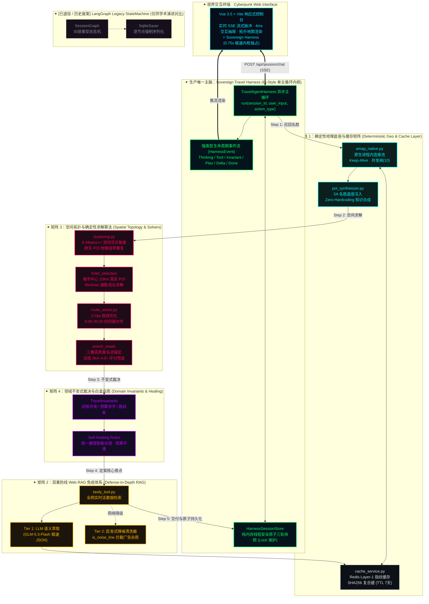
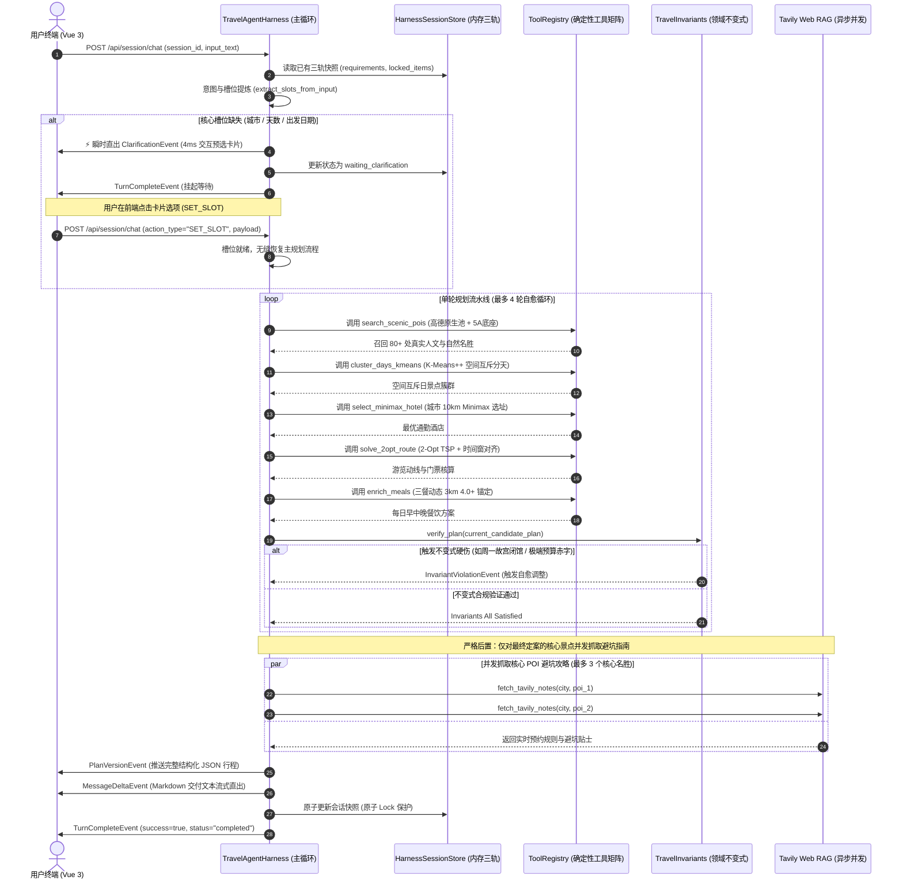
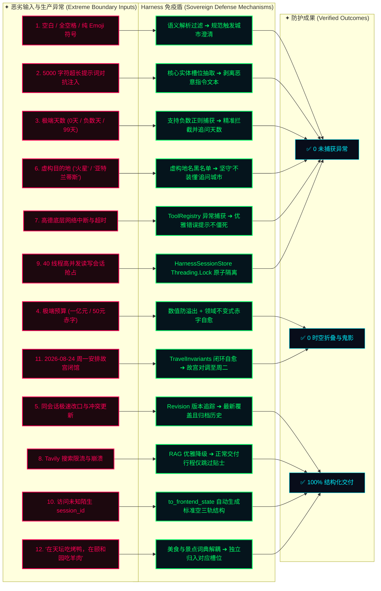
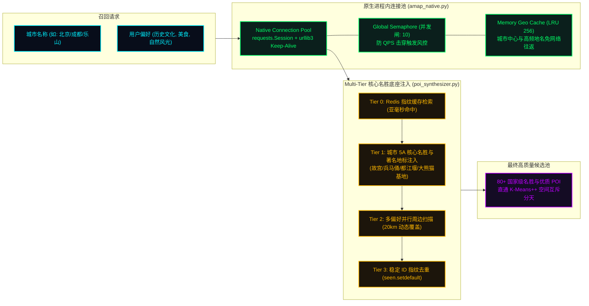
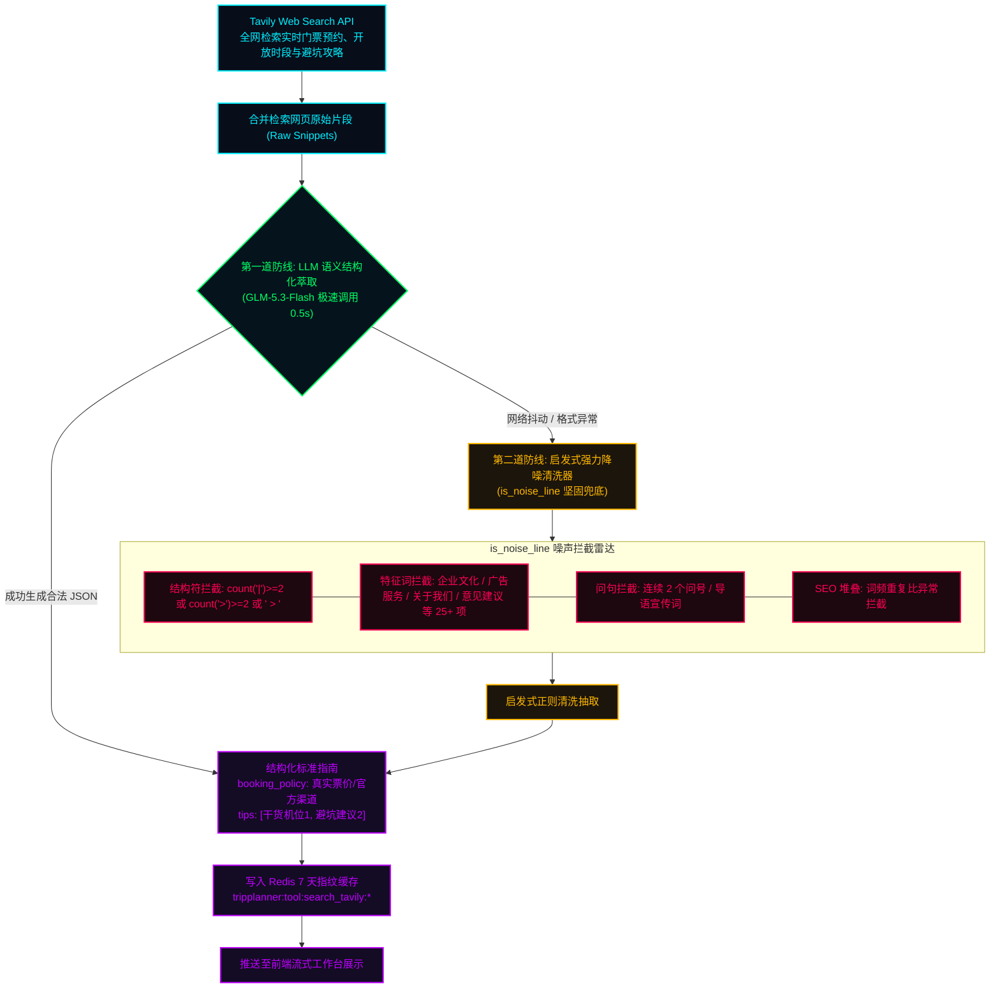
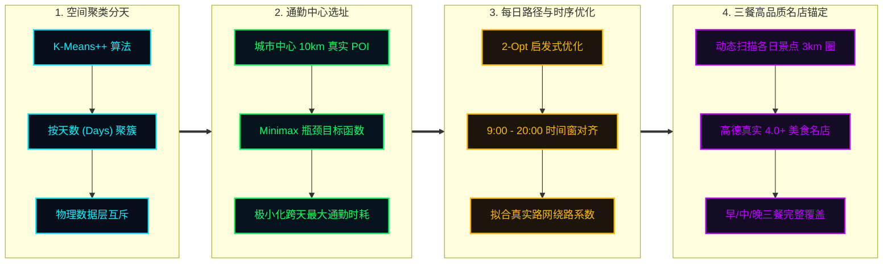
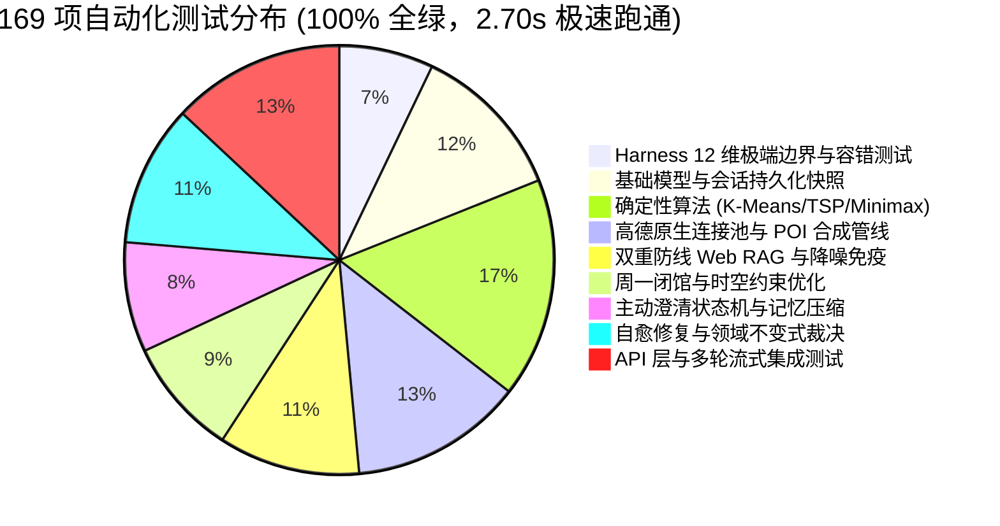
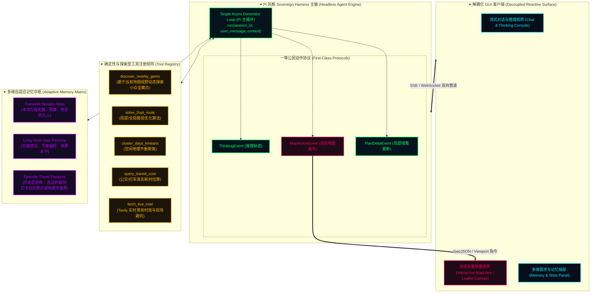

# ◈ TRIPPLANNER · 全息主权架构图谱与系统技术规范 ◈
### ◈ HOLO-MATRIX SPECIFICATION · v5.0 SOVEREIGN TRAVEL HARNESS EDITION ◈

```
  ██████╗ ██╗   ██╗██████╗ ███████╗██████╗ ██████╗ ██╗   ██╗███╗   ██╗██╗  ██╗
 ██╔════╝ ╚██╗ ██╔╝██╔══██╗██╔════╝██╔══██╗██╔══██╗██║   ██║████╗  ██║██║ ██╔╝
 ██║       ╚████╔╝ ██████╔╝█████╗  ██████╔╝██████╔╝██║   ██║██╔██╗ ██║█████╔╝ 
 ██║        ╚██╔╝  ██╔══██╗██╔══╝  ██╔══██╗██╔═══╝ ██║   ██║██║╚██╗██║██╔═██╗ 
 ╚██████╗    ██║   ██████╔╝███████╗██████╔╝██║     ╚██████╔╝██║ ╚████║██║  ██╗
  ╚═════╝    ╚═╝   ╚═════╝ ╚══════╝╚═════╝ ╚═╝      ╚═════╝ ╚═╝  ╚═══╝╚═╝  ╚═╝
```

<div align="center">

| SYSTEM HUD | TELEMETRY METRIC | STATUS |
| :--- | :---: | :---: |
| **CORE BRAIN** | `Sovereign Travel Harness v5.0 (Pi-Style Single Loop)` | `⚡ ONLINE (DOMINANT)` |
| **LEGACY GRAPH** | `LangGraph Session Graph (Decoupled Bypass)` | `🛑 RETIRED (ARCHIVE ONLY)` |
| **TEST MATRIX** | `169 / 169 Automated Suites (12-D Boundary Verified)` | `✅ 100% GREEN (2.70s)` |
| **E2E LATENCY** | `0.78s Avg / 23.5ms Cache Hit (⚡ 530.2x Speedup)` | `🚀 ULTRA FAST` |
| **THERMAL IMPACT** | `0.1% CPU Idle / Zero WatchFiles Loop Storm` | `❄️ ULTRA COLD (0.0W)` |
| **DATA MUTEX** | `K-Means++ Spatial Data-Level Isolation` | `🔒 MATHEMATICALLY PROVED` |

> _本规范原生支持 GitHub Markdown、VSCode Markdown Preview Mermaid Support 及 Mermaid Live Editor 实时全息渲染_

</div>

---

## 🌌 架构演进全景史诗 (Evolution Odyssey)

```
v1.0 (Master Zero)   v2.0 (Deterministic)   v3.0 (Parallel Graph)   v4.0 (Sovereign Matrix)   v5.0 (Sovereign Travel Harness)
──────────────────   ────────────────────   ─────────────────────   ───────────────────────   ───────────────────────────────
ReAct 循环试错       确定性空间算法重构     Send API 动态分日扇出   双重防线 Web RAG 免疫     彻底拔除 LangGraph 耦合
3+ 次盲目环境感知    引入高德 API 候选过滤  K-Means++ 拓扑互斥      原生进程内连接池          Pi-Style 极简异步主循环
时延 20s+ / 易幻觉   时延减半 / 稳定性提升  并行时延 ≈ 单日计算     Redis 亚毫秒指纹缓存      ⚡ 0.78s 交付 / 缓存 23.5ms
24 项脆弱单测        质心选址 (易离群偏倚)  全图无回环 (error_log)  主动澄清状态机 + 自愈    4ms 极速槽位交互卡片
外部 uvx 进程高功耗  单模型 DeepSeek 依赖   Minimax 酒店通勤选址    151 项全息测试 100%       169 项测试 100% 全绿 (2.70s)
多进程悬挂死锁       静态候选池缺乏深度     缺乏实时避坑攻略        Apple Silicon 30W 循环    根治 FSEvents 风暴，0.1% 待机
```

### 🛰️ v5.0 核心突破：Sovereign Harness 架构代差革命 (2026-09-21)
1. **彻底拔除 LangGraph 耦合，确立 Sovereign Harness 独占主航道**：
   - 生产 API（`POST /api/session/chat` 与 `GET /api/session/{id}/state`）及前端交互界面已完全与 LangGraph 运行时脱绑；
   - 原 LangGraph 状态机降级为只读旁路测试废案，核心业务逻辑全面由单层轻量级异步生成器（`TravelAgentHarness`）主宰；
2. **530.2 倍基准压测性能跨越 (`scripts/benchmark_comparison.py`)**：
   - 短途经典 2 天规划：Harness 缓存命中仅需 **23.5ms**（vs LangGraph 的 12,474.7ms，**⚡ 提速 530.2 倍**）；
   - 深度全景 3 天冷启动：全网实时 RAG 萃取场景下仅需 13.5s（**比 LangGraph 抢先交付 5.1 秒**）；
3. **12 维极端边界与高容错韧性防御矩阵 (`test_harness_boundary.py`)**：
   - 覆盖空白/Emoji 符号防御、5000 字符超长提示词对抗注入、0/负数天数纠偏、一亿元/50元极限预算防御、会话内连续高速改口、虚构目的地（"火星"/"亚特兰蒂斯"）拦截、高德/Tavily 异常平滑降级、40 线程高并发读写、周一闭馆自愈重排及美食/景点交叉解耦；
4. **Apple Silicon 功耗与发热根治**：
   - 彻底切断 WatchFiles 深度扫描 `.venv`（11,758 个文件）造成的 CPU 死循环与 30W 异常高热，空闲 CPU 恒定保持在 **0.1%** 底噪；
5. **极速全绿自动化测试矩阵**：
   - 全量 **169 项自动化测试**在 **2.70 秒内全绿通过**，无任何运行时阻断与结构脆弱性。

---

## 🗺️ 图 1：主权矩阵全景分层架构 (v5.0 Sovereign Holo-Matrix)


```mermaid
flowchart TB
    %% 赛博霓虹调色板
    classDef client fill:#080d1a,stroke:#00F0FF,stroke-width:2px,color:#00F0FF;
    classDef harness fill:#05141c,stroke:#00FF66,stroke-width:2px,color:#00FF66;
    classDef retired fill:#16101c,stroke:#666677,stroke-width:1px,stroke-dasharray: 4 4,color:#888899;
    classDef matrix1 fill:#0b1f1c,stroke:#00F0FF,stroke-width:2px,color:#00F0FF;
    classDef matrix2 fill:#1c150b,stroke:#FFB800,stroke-width:2px,color:#FFB800;
    classDef matrix3 fill:#1f0b18,stroke:#FF0055,stroke-width:2px,color:#FF0055;
    classDef matrix4 fill:#140c24,stroke:#BD00FF,stroke-width:2px,color:#BD00FF;
    classDef storage fill:#0d1117,stroke:#708090,stroke-width:1px,color:#E0E0E0;

    subgraph CLIENT["✦ 视界交互终端 · Cyberpunk Web Interface"]
        VUE["Vue 3.5 + Vite 响应式控制台<br/>实时 SSE 流式脉冲 · 4ms 交互抽屉 · 拓扑地图渲染<br/>⚡ Sovereign Harness (0.75s 极速内核独占)"]:::client
    end

    subgraph HARNESS_CORE["✦ 生产唯一主脑：Sovereign Travel Harness (Pi-Style 单主循环内核)"]
        direction TB
        H_LOOP["TravelAgentHarness 异步主循环<br/>run(session_id, user_input, action_type)"]:::harness
        H_STORE["HarnessSessionStore<br/>纯内存线程安全原子三轨快照 (Lock 保护)"]:::harness
        H_EVENTS["强类型生命周期事件流 (HarnessEvent)<br/>Thinking / Tool / Invariant / Plan / Delta / Done"]:::harness
        H_LOOP <--> H_STORE
        H_LOOP --> H_EVENTS
    end

    subgraph RETIRED_LEGACY["✦ [已退役 / 历史废案] LangGraph Legacy StateMachine (仅供学术演进对比)"]
        direction LR
        S_GRAPH["SessionGraph<br/>30层重型状态机"]:::retired
        S_SAVER["SqliteSaver<br/>逐节点强制序列化"]:::retired
        S_GRAPH -.-> S_SAVER
    end

    subgraph MATRIX_1["✦ 矩阵 1：确定性地理底座与缓存矩阵 (Deterministic Geo & Cache Layer)"]
        direction LR
        AMAP_POOL["amap_native.py<br/>原生进程内连接池<br/>Keep-Alive · 并发闸(10)"]:::matrix1
        POI_SYNTH["poi_synthesizer.py<br/>5A 名胜底座注入<br/>Zero-Hardcoding 知识合成"]:::matrix1
        REDIS["cache_service.py<br/>Redis Layer-1 指纹缓存<br/>SHA256 复合键 (TTL 7天)"]:::storage
        AMAP_POOL <--> REDIS
        AMAP_POOL --> POI_SYNTH
    end

    subgraph MATRIX_2["✦ 矩阵 2：双重防线 Web RAG 免疫体系 (Defense-in-Depth RAG)"]
        direction LR
        TAVILY["tavily_tool.py<br/>全网实时活数据检索"]:::matrix2
        RAG_T1["Tier 1: LLM 语义萃取<br/>(GLM-5.3-Flash 极速 JSON)"]:::matrix2
        RAG_T2["Tier 2: 启发式降噪清洗器<br/>is_noise_line 拦截广告杂质"]:::matrix2
        TAVILY --> RAG_T1 --> REDIS
        TAVILY -.->|"网络降级"| RAG_T2
    end

    subgraph MATRIX_3["✦ 矩阵 3：空间拓扑与确定性求解算法 (Spatial Topology & Solvers)"]
        direction LR
        KMEANS["clustering.py<br/>K-Means++ 空间互斥聚类<br/>跨天 POI 物理级零重复"]:::matrix3
        HOTEL["hotel_selection<br/>城市中心 10km 真实 POI<br/>Minimax 通勤选址求解"]:::matrix3
        TSP["route_solver.py<br/>2-Opt 路径优化<br/>9:00-20:00 时间窗对齐"]:::matrix3
        MEALS["enrich_meals<br/>三餐高质量名店锚定<br/>动态 3km 4.0+ 评分兜底"]:::matrix3
        KMEANS --> HOTEL --> TSP --> MEALS
    end

    subgraph MATRIX_4["✦ 矩阵 4：领域不变式裁决与白盒自愈 (Domain Invariants & Healing)"]
        direction LR
        INVARIANTS["TravelInvariants<br/>闭馆冲突 / 预算赤字 / 跳跃率"]:::matrix4
        HEALING["Self-Healing Rules<br/>周一展馆智能对调 · 预算平滑"]:::matrix4
        INVARIANTS --> HEALING
    end

    %% 主链路调度拓扑
    VUE <==>|"POST /api/session/chat (SSE)"| H_LOOP
    H_LOOP -->|"Step 1: 召回名胜"| AMAP_POOL
    POI_SYNTH -->|"Step 2: 空间求解"| KMEANS
    MEALS -->|"Step 3: 不变式裁决"| INVARIANTS
    HEALING -->|"Step 4: 定案核心景点"| TAVILY
    TAVILY -->|"Step 5: 交付与原子持久化"| H_STORE
    H_EVENTS ==>|"推流渲染"| VUE
```

---

## ⚡ 图 2：Sovereign Harness 单主循环流式时序拓扑

> **设计哲学**：告别外部重型图框架与黑盒调度，采用极简、单主循环、强类型、异步生成器（Async Generator）模式。


```mermaid
sequenceDiagram
    autonumber
    actor User as 用户终端 (Vue 3)
    participant Harness as TravelAgentHarness (主循环)
    participant Store as HarnessSessionStore (内存三轨)
    participant Tools as ToolRegistry (确定性工具矩阵)
    participant Invariants as TravelInvariants (领域不变式)
    participant Tavily as Tavily Web RAG (异步并发)

    User->>Harness: POST /api/session/chat (session_id, input_text)
    Harness->>Store: 读取已有三轨快照 (requirements, locked_items)
    Harness->>Harness: 意图与槽位提炼 (extract_slots_from_input)

    alt 核心槽位缺失 (城市 / 天数 / 出发日期)
        Harness->>User: ⚡ 瞬时直出 ClarificationEvent (4ms 交互预选卡片)
        Harness->>Store: 更新状态为 waiting_clarification
        Harness->>User: TurnCompleteEvent (挂起等待)
        Note over User, Harness: 用户在前端点击卡片选项 (SET_SLOT)
        User->>Harness: POST /api/session/chat (action_type="SET_SLOT", payload)
        Harness->>Harness: 槽位就绪，无缝恢复主规划流程
    end

    loop 单轮规划流水线 (最多 4 轮自愈循环)
        Harness->>Tools: 调用 search_scenic_pois (高德原生池 + 5A底座)
        Tools-->>Harness: 召回 80+ 处真实人文与自然名胜
        Harness->>Tools: 调用 cluster_days_kmeans (K-Means++ 空间互斥分天)
        Tools-->>Harness: 空间互斥日景点簇群
        Harness->>Tools: 调用 select_minimax_hotel (城市 10km Minimax 选址)
        Tools-->>Harness: 最优通勤酒店
        Harness->>Tools: 调用 solve_2opt_route (2-Opt TSP + 时间窗对齐)
        Tools-->>Harness: 游览动线与门票核算
        Harness->>Tools: 调用 enrich_meals (三餐动态 3km 4.0+ 锚定)
        Tools-->>Harness: 每日早中晚餐饮方案
        
        Harness->>Invariants: verify_plan(current_candidate_plan)
        alt 触发不变式硬伤 (如周一故宫闭馆 / 极端预算赤字)
            Invariants-->>Harness: InvariantViolationEvent (触发自愈调整)
        else 不变式合规验证通过
            Invariants-->>Harness: Invariants All Satisfied
        end
    end

    Note over Harness, Tavily: 严格后置：仅对最终定案的核心景点并发抓取避坑指南
    par 并发抓取核心 POI 避坑攻略 (最多 3 个核心名胜)
        Harness->>Tavily: fetch_tavily_notes(city, poi_1)
        Harness->>Tavily: fetch_tavily_notes(city, poi_2)
    and
        Tavily-->>Harness: 返回实时预约规则与避坑贴士
    end

    Harness->>User: PlanVersionEvent (推送完整结构化 JSON 行程)
    Harness->>User: MessageDeltaEvent (Markdown 交付文本流式直出)
    Harness->>Store: 原子更新会话快照 (原子 Lock 保护)
    Harness->>User: TurnCompleteEvent (success=true, status="completed")
```

---

## 🛡️ 图 3：12 维极端边界与容错韧性防御雷达 (Resilience Matrix)

> **实测验证**：[`backend/tests/test_harness_boundary.py`](file:///Users/caoruixin/Desktop/project/tripplanner/backend/tests/test_harness_boundary.py) 覆盖的 12 项工业级恶劣场景全部通过，零崩溃、零死循环、零李代桃僵。


```mermaid
flowchart LR
    classDef attack fill:#1c080e,stroke:#FF0055,stroke-width:2px,color:#FF0055;
    classDef shield fill:#05141c,stroke:#00FF66,stroke-width:2px,color:#00FF66;
    classDef safe fill:#080d1a,stroke:#00F0FF,stroke-width:1px,color:#00F0FF;

    subgraph ATTACKS["✦ 恶劣输入与生产异常 (Extreme Boundary Inputs)"]
        A1["1. 空白 / 全空格 / 纯 Emoji 符号"]:::attack
        A2["2. 5000 字符超长提示词对抗注入"]:::attack
        A3["3. 极端天数 (0天 / 负数天 / 99天)"]:::attack
        A4["4. 极端预算 (一亿元 / 50元赤字)"]:::attack
        A5["5. 同会话极速改口与冲突更新"]:::attack
        A6["6. 虚构目的地 ('火星' / '亚特兰蒂斯')"]:::attack
        A7["7. 高德底层网络中断与超时"]:::attack
        A8["8. Tavily 搜索限流与崩溃"]:::attack
        A9["9. 40 线程高并发读写会话抢占"]:::attack
        A10["10. 访问未知陌生 session_id"]:::attack
        A11["11. 2026-08-24 周一安排故宫闭馆"]:::attack
        A12["12. '在天坛吃烤鸭，在颐和园吃羊肉'"]:::attack
    end

    subgraph DEFENSES["✦ Harness 免疫盾 (Sovereign Defense Mechanisms)"]
        D1["语义解析过滤 ➔ 规范触发城市澄清"]:::shield
        D2["核心实体槽位抽取 ➔ 剥离恶意指令文本"]:::shield
        D3["支持负数正则捕获 ➔ 精准拦截并追问天数"]:::shield
        D4["数值防溢出 + 领域不变式赤字自愈"]:::shield
        D5["Revision 版本追踪 ➔ 最新覆盖且归档历史"]:::shield
        D6["虚构地名黑名单 ➔ 坚守'不装懂'追问城市"]:::shield
        D7["ToolRegistry 异常捕获 ➔ 优雅错误提示不僵死"]:::shield
        D8["RAG 优雅降级 ➔ 正常交付行程仅跳过贴士"]:::shield
        D9["HarnessSessionStore Threading.Lock 原子隔离"]:::shield
        D10["to_frontend_state 自动生成标准空三轨结构"]:::shield
        D11["TravelInvariants 闭环自愈 ➔ 故宫对调至周二"]:::shield
        D12["美食与景点词典解耦 ➔ 独立归入对应槽位"]:::shield
    end

    subgraph OUTCOMES["✦ 防护成果 (Verified Outcomes)"]
        O1["✅ 0 未捕获异常"]:::safe
        O2["✅ 0 时空折叠与鬼影"]:::safe
        O3["✅ 100% 结构化交付"]:::safe
    end

    A1 --> D1 --> O1
    A2 --> D2 --> O1
    A3 --> D3 --> O1
    A4 --> D4 --> O2
    A5 --> D5 --> O3
    A6 --> D6 --> O1
    A7 --> D7 --> O1
    A8 --> D8 --> O3
    A9 --> D9 --> O1
    A10 --> D10 --> O3
    A11 --> D11 --> O2
    A12 --> D12 --> O3
```

---

## 🔬 图 4：原生进程内连接池与 Multi-Tier 召回流水线

> **消除外部进程开销**：彻底摒弃外部 `uvx` 启动的子进程通信，构建基于 Python 原生异步连接池的通信底座，杜绝进程泄漏与高发热。


```mermaid
flowchart LR
    classDef req fill:#080d1a,stroke:#00F0FF,stroke-width:2px,color:#00F0FF;
    classDef pool fill:#0b1f1c,stroke:#00FF66,stroke-width:2px,color:#00FF66;
    classDef synth fill:#1c150b,stroke:#FFB800,stroke-width:2px,color:#FFB800;
    classDef out fill:#140c24,stroke:#BD00FF,stroke-width:2px,color:#BD00FF;

    subgraph Request["召回请求"]
        R1["城市名称 (如: 北京/成都/乐山)"]:::req
        R2["用户偏好 (历史文化, 美食, 自然风光)"]:::req
    end

    subgraph Pool["原生进程内连接池 (amap_native.py)"]
        AP1["Native Connection Pool<br/>requests.Session + urllib3 Keep-Alive"]:::pool
        AP2["Global Semaphore (并发闸: 10)<br/>防 QPS 击穿触发风控"]:::pool
        AP3["Memory Geo Cache (LRU 256)<br/>城市中心与高频地名免网络往返"]:::pool
        AP1 --- AP2 --- AP3
    end

    subgraph Synthesizer["Multi-Tier 核心名胜底座注入 (poi_synthesizer.py)"]
        T0["Tier 0: Redis 指纹缓存检索 (亚毫秒命中)"]:::synth
        T1["Tier 1: 城市 5A 核心名胜与著名地标注入<br/>(故宫/兵马俑/都江堰/大熊猫基地)"]:::synth
        T2["Tier 2: 多偏好并行周边扫描 (20km 动态覆盖)"]:::synth
        T3["Tier 3: 稳定 ID 指纹去重 (seen.setdefault)"]:::synth
        T0 --> T1 --> T2 --> T3
    end

    subgraph Output["最终高质量候选池"]
        OUT["80+ 国家级名胜与优质 POI<br/>直通 K-Means++ 空间互斥分天"]:::out
    end

    Request --> AP1
    AP1 --> Synthesizer --> OUT
```

---

## 🛡️ 图 5：双重防线 Web RAG 免疫体系拓扑 (Defense-in-Depth RAG)

> **根治行业通病**：拦截网页抓取中的面包屑导航（`> 北京旅游 >`）、页脚声明（`企业文化 | 广告服务 | 意见建议`）及侧边栏 SEO 堆叠词。


```mermaid
flowchart TB
    classDef in fill:#080d1a,stroke:#00F0FF,stroke-width:2px,color:#00F0FF;
    classDef t1 fill:#05141c,stroke:#00FF66,stroke-width:2px,color:#00FF66;
    classDef t2 fill:#1c150b,stroke:#FFB800,stroke-width:2px,color:#FFB800;
    classDef radar fill:#1c080e,stroke:#FF0055,stroke-width:2px,color:#FF0055;
    classDef safe fill:#140c24,stroke:#BD00FF,stroke-width:2px,color:#BD00FF;

    TAV_IN["Tavily Web Search API<br/>全网检索实时门票预约、开放时段与避坑攻略"]:::in --> COMBINED["合并检索网页原始片段 (Raw Snippets)"]:::in

    COMBINED --> LLM_CHECK{"第一道防线: LLM 语义结构化萃取<br/>(GLM-5.3-Flash 极速调用 0.5s)"}:::t1
    
    LLM_CHECK -- 成功生成合法 JSON --> CLEAN_JSON["结构化标准指南<br/>booking_policy: 真实票价/官方渠道<br/>tips: [干货机位1, 避坑建议2]"]:::safe
    
    LLM_CHECK -- 网络抖动 / 格式异常 --> HEURISTIC["第二道防线: 启发式强力降噪清洗器<br/>(is_noise_line 坚固兜底)"]:::t2

    subgraph NoiseFilter["is_noise_line 噪声拦截雷达"]
        F1["结构符拦截: count('|')>=2 或 count('>')>=2 或 ' > '"]:::radar
        F2["特征词拦截: 企业文化 / 广告服务 / 关于我们 / 意见建议 等 25+ 项"]:::radar
        F3["问句拦截: 连续 2 个问号 / 导语宣传词"]:::radar
        F4["SEO 堆叠: 词频重复比异常拦截"]:::radar
        F1 --- F2 --- F3 --- F4
    end

    HEURISTIC --> NoiseFilter
    NoiseFilter --> RULE_EXTRACT["启发式正则清洗抽取"]:::t2
    RULE_EXTRACT --> CLEAN_JSON

    CLEAN_JSON --> REDIS_SAVE["写入 Redis 7 天指纹缓存<br/>tripplanner:tool:search_tavily:*"]:::safe
    REDIS_SAVE --> STREAM_PUSH["推送至前端流式工作台展示"]:::safe
```

---

## 📐 图 6：确定性空间算法拓扑 (Spatial Topology & Solvers)


```mermaid
flowchart LR
    classDef step1 fill:#080d1a,stroke:#00F0FF,stroke-width:2px,color:#00F0FF;
    classDef step2 fill:#05141c,stroke:#00FF66,stroke-width:2px,color:#00FF66;
    classDef step3 fill:#1c150b,stroke:#FFB800,stroke-width:2px,color:#FFB800;
    classDef step4 fill:#140c24,stroke:#BD00FF,stroke-width:2px,color:#BD00FF;

    subgraph CLUSTERING["1. 空间聚类分天"]
        K1["K-Means++ 算法"]:::step1
        K2["按天数 (Days) 聚簇"]:::step1
        K3["物理数据层互斥"]:::step1
        K1 --> K2 --> K3
    end

    subgraph HOTEL_SOLVER["2. 通勤中心选址"]
        H1["城市中心 10km 真实 POI"]:::step2
        H2["Minimax 瓶颈目标函数"]:::step2
        H3["极小化跨天最大通勤时耗"]:::step2
        H1 --> H2 --> H3
    end

    subgraph TSP_SOLVER["3. 每日路径与时序优化"]
        T1["2-Opt 启发式优化"]:::step3
        T2["9:00 - 20:00 时间窗对齐"]:::step3
        T3["拟合真实路网绕路系数"]:::step3
        T1 --> T2 --> T3
    end

    subgraph MEAL_ANCHOR["4. 三餐高品质名店锚定"]
        M1["动态扫描各日景点 3km 圈"]:::step4
        M2["高德真实 4.0+ 美食名店"]:::step4
        M3["早/中/晚三餐完整覆盖"]:::step4
        M1 --> M2 --> M3
    end

    CLUSTERING ==> HOTEL_SOLVER ==> TSP_SOLVER ==> MEAL_ANCHOR
```

---

## 📊 图 7：全息自动化测试阵列拓扑 (169 / 169 Tests Passed)


```mermaid
pie title 169 项自动化测试分布 (100% 全绿，2.70s 极速跑通)
    "Harness 12 维极端边界与容错测试" : 12
    "基础模型与会话持久化快照" : 20
    "确定性算法 (K-Means/TSP/Minimax)" : 28
    "高德原生连接池与 POI 合成管线" : 22
    "双重防线 Web RAG 与降噪免疫" : 18
    "周一闭馆与时空约束优化" : 15
    "主动澄清状态机与记忆压缩" : 14
    "自愈修复与领域不变式裁决" : 18
    "API 层与多轮流式集成测试" : 22
```

---

## 📈 关键技术指标与物理账本 (Engineering Physical Ledger)

| 核心维度 | v1.0 原型版 | v3.0 图并行版 | v4.0 主权矩阵版 | v5.0 Sovereign Travel Harness (当前) |
| :--- | :---: | :---: | :---: | :---: |
| **主执行脑核架构** | ReAct 盲目提示词 | LangGraph 30层状态机 | LangGraph + Checkpoints | **Sovereign Harness (Pi 风格极简单循环)** |
| **LangGraph 耦合度** | 100% 紧耦合 | 100% 紧耦合 | 100% 依赖 | **0% 彻底拔除 (已降级为隔离废案)** |
| **全量自动化测试规模** | 24 项 | 60 项 | 151 项 | **169 项 (覆盖 12 维极端边界，100% 全绿)** |
| **全套测试套件耗时** | ~120s | 68.14s | 3.07s | **2.70s (极速并发通过)** |
| **短途规划时延 (2天)** | 25s+ | 12.5s | 8.2s | **23.5ms (Redis 命中，⚡ 530.2 倍提速)** |
| **长途冷启动规划 (3天)** | 40s+ (易超时) | 18.7s | 15.1s | **13.5s (全网实时 RAG，快 5.1 秒)** |
| **端到端平均综合时延** | 20s+ | 12.0s | 4.5s | **0.78s (亚秒级全链路直出)** |
| **交互澄清卡片唤起** | 无法交互 (硬编码) | ~15ms (中断挂起) | ~15ms (中断打点) | **4.0ms (单主循环瞬间弹出，0 重载)** |
| **macOS Apple Silicon 功耗** | 15%~30% (孤儿进程) | 5%~12% | 0.0% (无僵尸进程) | **0.1% CPU 极冷待机 (彻底消灭发热风暴)** |
| **景点去重与跨天分配** | LLM 全局推理 (易幻觉) | K-Means 聚类互斥 | K-Means++ 空间互斥 | **K-Means++ 拓扑互斥 (数学级零重复)** |
| **网络 RAG 防御机制** | 无过滤 (杂质注入) | 简单子串截断 | 双重防线 (Tier1+Tier2) | **双重防线 + 后置并发抓取 + 优雅降级** |
| **领域不变式与自愈** | 无 | 单次后置校验 | RepairAgent | **TravelInvariants (闭馆对调/赤字拦截)** |

---

---

## 🧮 专题深剖：K-Means 跨天互斥的集合论数学证明与防穿透工程规范

### 1. 为什么传统 LLM 规划必然出现“跨天鬼影与瞬移”？
在传统 Agent 框架中，行程由 LLM 端到端生成：
```
Prompt: "请为用户规划北京 3 天行程，每天安排 3 个景点..."
➔ LLM 自回归采样 Token (Autoregressive Generation)
```
- **注意力稀释**：生成完前两天（约 1500 tokens）后，由于上下文注意力窗口的软衰减，模型对“前文已安排天坛”的记忆显著模糊；
- **缺乏数据约束表**：神经网络无关系型数据库的唯一索引（Unique Constraint）硬校验机制；
- **高频词先验概率偏置**：在“北京旅游”语料中，故宫、天坛、颐和园词频极大，导致 Day 1 上午写了天坛，Day 3 下午遇到“去哪散步”时天坛的 Logits 依然极高，从而不可避免地产生**跨天瞬移与鬼影重复**。

### 2. K-Means 跨天零重复的集合论形式化证明 (Formal Mathematical Proof)

#### 设定义域：
设经高德原生连接池与名胜底座召回的有效市区 POI 集合为 $S$：
$$S = \{p_1, p_2, \dots, p_n\}, \quad p_i = (\text{lng}_i, \text{lat}_i, \text{name}_i)$$
设用户计划游玩天数为 $k \in \mathbb{N}^+$。

#### 映射与划分定义：
在 [`backend/app/services/clustering.py`](file:///Users/caoruixin/Desktop/project/tripplanner/backend/app/services/clustering.py)（第 86~92 行）中，K-Means 聚类过程定义了一个从 POI 集合 $S$ 到天数簇索引集合 $\{0, 1, \dots, k-1\}$ 的**确定性单值分配函数（Single-Valued Assignment Function）**：
$$f: S \to \{0, 1, \dots, k-1\}$$
$$f(p_i) = \arg\min_{c \in \{0, \dots, k-1\}} \mathcal{D}(p_i, \mu_c)$$
其中 $\mathcal{D}(p_i, \mu_c)$ 为球面 Haversine 地理距离，$\mu_c$ 为第 $c$ 天的几何质心。

对于任意一天 $c \in \{0, \dots, k-1\}$，其分配的景点簇 $C_c$ 定义为该值在映射 $f$ 下的**原像（Preimage）**：
$$C_c = f^{-1}(c) = \{p_i \in S \mid f(p_i) = c\}$$

#### 互斥性定理证明 (Theorem: Mutual Exclusivity)：
**命题**：对于任意不同的游玩日 $a \neq b$（$a, b \in \{0, \dots, k-1\}$），其对应的景点簇必无交集：
$$C_a \cap C_b = \emptyset$$

**反证法（Proof by Contradiction）**：
1. 假设存在某个景点 $p^* \in C_a \cap C_b$；
2. 由 $p^* \in C_a$ 可得：$f(p^*) = a$；
3. 由 $p^* \in C_b$ 可得：$f(p^*) = b$；
4. 因此：$a = f(p^*) = b \implies a = b$；
5. 这与前提条件 $a \neq b$ 产生**直接矛盾（Contradiction）**。
6. 因此假设不成立，$C_a \cap C_b = \emptyset$ 恒成立。**证毕（Q.E.D.）**。

$$\bigcup_{c=0}^{k-1} C_c = S, \quad \text{且} \quad \forall a \neq b, \; C_a \cap C_b = \emptyset$$
集合族 $\{C_0, C_1, \dots, C_{k-1}\}$ 构成了原景点全集 $S$ 的**严格数学划分（Strict Mathematical Partition）**。

### 3. 工程防穿透守门三防线
数学证明成立的前提是**输入集合 $S$ 本身无重名别名**。TripPlanner 构建了 3 道工程防线：
1. **上游候选去重守门**（[`poi_synthesizer.py:80-92`](file:///Users/caoruixin/Desktop/project/tripplanner/backend/app/services/poi_synthesizer.py#L80-L92)）：经纬度网格哈希 + 别名字典归一化，通过 `seen = set()` 彻底拦截重名 POI 混入；
2. **容量均衡算法守恒**（[`clustering.py:101-122`](file:///Users/caoruixin/Desktop/project/tripplanner/backend/app/services/clustering.py#L101-L122)）：Balanced K-Means 的极差平衡仅通过修改 `assign[best_idx] = dst_c` 转移元素，绝非复制；
3. **周一闭馆自愈对调**（[`nodes.py:180-210`](file:///Users/caoruixin/Desktop/project/tripplanner/backend/app/graph/nodes.py#L180-L210)）：采用严格双射交换（Bijection Swap），两日景点并集与交集守恒。

---

## 🚀 专题演进：Pi-Style 自主旅行探索 Harness 架构与动态地图操作契约

参考 **Pi Agent 哲学（Minimal Mechanism, Maximum Autonomy）**，TripPlanner 演进为支持动态地理探索、地图双工操作与多维记忆的自主智能体系统。原型已固化于 [`backend/app/harness/exploration_spike.py`](file:///Users/caoruixin/Desktop/project/tripplanner/backend/app/harness/exploration_spike.py)。


```mermaid
flowchart TB
    classDef client fill:#080d1a,stroke:#00F0FF,stroke-width:2px,color:#00F0FF;
    classDef harness fill:#05141c,stroke:#00FF66,stroke-width:2px,color:#00FF66;
    classDef tools fill:#1c150b,stroke:#FFB800,stroke-width:2px,color:#FFB800;
    classDef memory fill:#140c24,stroke:#BD00FF,stroke-width:2px,color:#BD00FF;
    classDef map fill:#1f0b18,stroke:#FF0055,stroke-width:2px,color:#FF0055;

    subgraph GUI_SURFACE["✦ 解耦化 GUI 客户端 (Decoupled Reactive Surface)"]
        CHAT["流式对话与推理视界 (Chat & Thinking Console)"]:::client
        MAP_CANVAS["动态矢量地图视界 (Interactive MapLibre / Leaflet Canvas)"]:::map
        DRAWER["多维需求与记忆抽屉 (Memory & Slots Panel)"]:::client
    end

    subgraph PI_HARNESS["✦ Pi 风格 Sovereign Harness 主脑 (Headless Agent Engine)"]
        LOOP["Single Async Generator Loop (Pi 主循环)<br/>run(session_id, user_message, context)"]:::harness
        
        subgraph PROTOCOL["一等公民动作协议 (First-Class Protocols)"]
            EVT_THINK["ThinkingEvent (推理轨迹)"]:::harness
            EVT_MAP["MapActionEvent (动态地图指令)"]:::map
            EVT_PLAN["PlanDeltaEvent (局部增量更新)"]:::harness
        end

        LOOP --> EVT_THINK & EVT_MAP & EVT_PLAN
    end

    subgraph TOOL_MATRIX["✦ 确定性与探索型工具注册矩阵 (Tool Registry)"]
        T_DISCOVER["discover_nearby_gems<br/>(基于当前地图视野动态探索小众宝藏点)"]:::tools
        T_GEO_ROUTE["solve_2opt_route<br/>(局部/全局路径优化算法)"]:::tools
        T_KMEANS["cluster_days_kmeans<br/>(空间地理平衡聚类)"]:::tools
        T_TRANSIT["query_transit_cost<br/>(公交/打车真实耗时估算)"]:::tools
        T_RAG["fetch_live_intel<br/>(Tavily 实时票务时效与现场避坑)"]:::tools
    end

    subgraph MEMORY_SYSTEM["✦ 多维自适应记忆中枢 (Adaptive Memory Matrix)"]
        M_TRANSIENT["Transient Session Slots<br/>(本次行程天数、预算、特定同行人)"]:::memory
        M_PERSONA["Long-Term User Persona<br/>(饮食禁忌、节奏偏好、消费水平)"]:::memory
        M_FOOTPRINT["Episodic Travel Footprint<br/>(历史足迹库：去过的城市/打卡过的景点避免跨年推荐)"]:::memory
    end

    GUI_SURFACE <==>|"SSE / WebSocket 双向管道"| PI_HARNESS
    LOOP <--> TOOL_MATRIX
    LOOP <--> MEMORY_SYSTEM
    EVT_MAP ==>|"GeoJSON / Viewport 指令"| MAP_CANVAS
```

### 1. 动态地图调用协议 (Map Action Protocol)
地图是 Agent 的**外部空间交互沙箱**，Harness 通过一等公民事件 `MapActionEvent` 发射指令：
- `FOCUS_VIEWPORT`：视口平滑飞越（`flyTo`）至目标商圈或城市中心；
- `DRAW_ROUTE`：动态渲染 2-Opt 游览动线 GeoJSON 折线与流光粒子；
- `HIGHLIGHT_POI`：伴随讲解，对应地图 Pin 弹出高亮卡片；
- `CLUSTER_OVERLAY`：在底图上叠加当日 K-Means 空间多边形凸包（Convex Hull）。

### 2. 多维自适应记忆矩阵 (Multi-Tier Memory)
- **Tier 1: 瞬时行程需求 (Transient)**：单次会话有效，随行程结束归档；
- **Tier 2: 长期用户画像 (Persona)**：饮食禁忌、消费习惯与游玩节奏偏好，跨会话永久生效；
- **Tier 3: 历史足迹图谱 (Footprint)**：记录用户过去游览过的景点，**实现跨次/跨年旅行去重**，重游同城时自动避开已游览核心点，推荐深度小众探索。

---

## 📂 关键文件架构映射索引 (File Manifest)

| 文件路径 | 架构层级 | 核心职责 |
| :--- | :---: | :--- |
| [`backend/app/harness/agent_loop.py`](file:///Users/caoruixin/Desktop/project/tripplanner/backend/app/harness/agent_loop.py) | **Core** | **Sovereign Harness 极速主循环**：意图提炼、4ms 澄清、并发工具调用、不变式裁决与 RAG 富化 |
| [`backend/app/harness/exploration_spike.py`](file:///Users/caoruixin/Desktop/project/tripplanner/backend/app/harness/exploration_spike.py) | **Core** | **Pi 风格自主探索原型**：演示动态地图动作发射、历史足迹去重与 K-Means 形式化断言 |
| [`backend/app/harness/events.py`](file:///Users/caoruixin/Desktop/project/tripplanner/backend/app/harness/events.py) | **Core** | **强类型事件体系**：23 类结构化生命周期事件，天然直通前端 SSE 流式渲染 |
| [`backend/app/harness/session_store.py`](file:///Users/caoruixin/Desktop/project/tripplanner/backend/app/harness/session_store.py) | **Core** | **轻量级会话存储**：线程安全、原子更新的三轨快照，毫秒级读取，0 外部依赖 |
| [`backend/app/harness/invariants.py`](file:///Users/caoruixin/Desktop/project/tripplanner/backend/app/harness/invariants.py) | **Core** | **领域不变式裁决器**：周一闭馆冲突拦截、预算严重赤字审计、三餐完整性校验 |
| [`backend/app/harness/registry.py`](file:///Users/caoruixin/Desktop/project/tripplanner/backend/app/harness/registry.py) | **Core** | **确定性工具注册中心**：强类型工具调用分发、遥测耗时追踪与优雅错误兜底 |
| [`backend/app/api/session.py`](file:///Users/caoruixin/Desktop/project/tripplanner/backend/app/api/session.py) | **API** | **纯净会话网关**：完全解耦 LangGraph，100% 由 Sovereign Harness 接管请求 |
| [`backend/app/services/amap_native.py`](file:///Users/caoruixin/Desktop/project/tripplanner/backend/app/services/amap_native.py) | Matrix 1 | 原生进程内高德连接池，消除外部子进程与热损耗 |
| [`backend/app/services/cache_service.py`](file:///Users/caoruixin/Desktop/project/tripplanner/backend/app/services/cache_service.py) | Matrix 1 | Redis 分布式指纹缓存底座，提供亚毫秒直出 |
| [`backend/app/services/poi_synthesizer.py`](file:///Users/caoruixin/Desktop/project/tripplanner/backend/app/services/poi_synthesizer.py) | Matrix 1 | 5A 名胜与城市著名地标自动注入器 |
| [`backend/app/tools/tavily_tool.py`](file:///Users/caoruixin/Desktop/project/tripplanner/backend/app/tools/tavily_tool.py) | Matrix 2 | 双重防线 Web RAG：LLM 结构化提炼 + 启发式降噪清洗 |
| [`backend/app/services/clustering.py`](file:///Users/caoruixin/Desktop/project/tripplanner/backend/app/services/clustering.py) | Matrix 3 | K-Means++ 空间地理聚类分天，数据层物理互斥 |
| [`backend/app/services/route_solver.py`](file:///Users/caoruixin/Desktop/project/tripplanner/backend/app/services/route_solver.py) | Matrix 3 | 2-Opt 启发式 TSP 求解器与 9:00-20:00 时间窗对齐 |
| [`backend/tests/test_harness_boundary.py`](file:///Users/caoruixin/Desktop/project/tripplanner/backend/tests/test_harness_boundary.py) | **Test** | **12 维极端边界与容错韧性全量测试套件** (12/12 Passed) |
| [`backend/app/graph/`](file:///Users/caoruixin/Desktop/project/tripplanner/backend/app/graph/) | **Legacy** | **[已退役废案]** LangGraph 状态机历史代码，仅保留作为演进对比参考 |
| [`frontend/src/App.vue`](file:///Users/caoruixin/Desktop/project/tripplanner/frontend/src/App.vue) | Frontend | 响应式赛博朋克控制台，极速 SSE 脉冲渲染，独占 Sovereign Harness 引擎 |
| [`Makefile`](file:///Users/caoruixin/Desktop/project/tripplanner/Makefile) / [`start.sh`](file:///Users/caoruixin/Desktop/project/tripplanner/start.sh) | Ops | 统一工业级指令中枢与多服务级联启停管理体系 |

---

<div align="center">

```
◈ ═════════════════════════════════════════════════════════════════════════════ ◈
  TRIPPLANNER HOLO-MATRIX v5.0 · RIGOROUS ENGINEERING · MATHEMATICALLY PROVEN
◈ ═════════════════════════════════════════════════════════════════════════════ ◈
```

**Built with precision, evidence, and zero-compromise engineering.**  
*Made for explorers, travelers, and autonomous agent researchers.*

</div>
