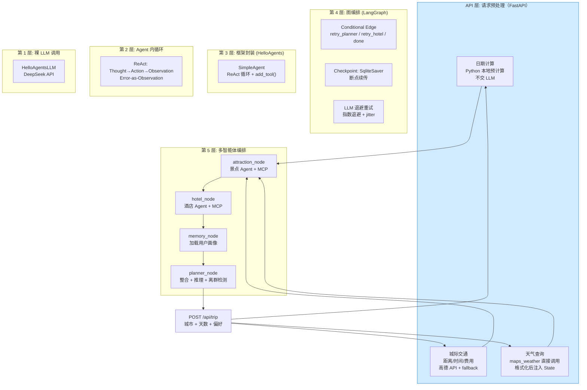
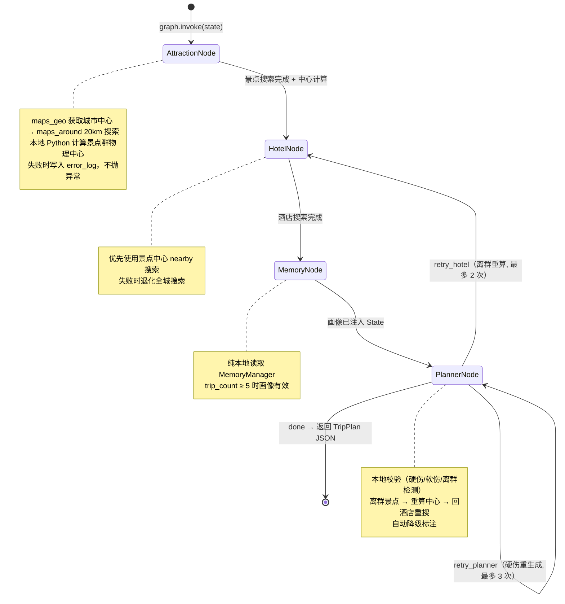

<div align="center">


# 🧳 TripPlanner

> 基于 LangGraph + ReAct 自研编排的多智能体旅行规划系统
> 4 Node StateGraph · MCP 协议 · 五因子权重记忆 · 双轨异常检测

[](https://python.org)
[](https://langchain-ai.github.io/langgraph/)
[](https://fastapi.tiangolo.com/)
[](https://modelcontextprotocol.io)
[](LICENSE)

输入出发地 + 目的地 + 偏好 → 3 个 Agent 协作生成完整旅行计划（景点/酒店/预算），
天气 + 城际交通在 API 层预处理，景点离群检测自动过滤远郊景点，用户画像随使用次数渐进构建。

</div>

---

## ✨ 功能特性

- 🤖 **多智能体协作**：景点 / 酒店 / 规划 3 个 Agent 基于 LangGraph 4 Node StateGraph 编排
- 🗺 **MCP 工具集成**：amap-mcp-server 提供 16 个高德地图工具，Agent 通过统一 Wrapper 调用
- 🧠 **渐进式用户画像**：五因子权重公式 + 双轨异常检测（IQR + 频率比），5 次行程后画像生效
- 🔄 **Conditional Edge 自愈**：硬伤重生成（≤3 次）+ 离群景点重算（≤2 次）
- 🛡 **三层容错**：Error-as-Observation + error_log 累积 + FallbackTool 兜底
- ⚡ **并发优化**：API 预处理并行、maps_geo 双查并行、LangGraph fan-out 拓扑
- 📡 **SSE 流式响应**：前端实时展示每个 Node 的执行进度，断开自动取消

---

## 🏗 架构设计

### 系统分层（6 层）



### 状态机流转（4 Node + Conditional Edge）



> 📖 **完整架构文档**：7 张 Mermaid 图（分层 / 状态机 / 时序 / 工具 Wrapper / 记忆 / 错误恢复 / 分层映射）见 [ARCHITECTURE.md](ARCHITECTURE.md)

### 核心设计要点

| 设计 | 说明 |
|------|------|
| 工具封装 | Agent 视角只看到 1 个 Tool（AmapToolWrapper），内部 MCP → Format → Validate 三层 |
| 记忆机制 | `final_weight = domain × decay × interaction × frequency_boost × outlier_penalty` |
| 异常检测 | 数值型 IQR + 分类型频率比，偶然行为不污染画像 |
| 容错体系 | SqliteSaver 断点续传 + LLM 退避重试 + MCP 超时 + SSE 取消 + 记忆去重 |

### 技术栈

| 组件 | 选型 |
|------|------|
| 编排引擎 | LangGraph StateGraph |
| Agent 框架 | HelloAgents SimpleAgent |
| 工具协议 | MCP (amap-mcp-server, 16 个工具) |
| LLM | DeepSeek (via HelloAgentsLLM) |
| Web 框架 | FastAPI + Pydantic v2 |
| 记忆 | 自定义五因子权重 + 双轨异常检测 |
| 前端 | 单文件 HTML (零依赖) |

---

## 🚀 快速开始

### 1. 克隆项目

```bash
git clone https://github.com/SuperGODOG/tripplanner.git
cd tripplanner/backend
```

### 2. 创建虚拟环境

```bash
python3 -m venv venv
source venv/bin/activate       # Linux/macOS
# venv\Scripts\activate        # Windows
```

### 3. 配置 API Key

```bash
cp .env.example .env
nano .env
```

填入你的 Key：

```ini
LLM_API_KEY=your-deepseek-api-key
LLM_MODEL_ID=deepseek-chat
LLM_BASE_URL=https://api.deepseek.com/v1
AMAP_API_KEY=your-amap-web-service-key
```

> **高德 Key 申请**：https://console.amap.com/dev/key/app → 选择「Web 服务」类型
>
> **DeepSeek Key 申请**：https://platform.deepseek.com/api_keys

### 4. 安装依赖并启动

```bash
# 配置国内镜像加速（可选）
pip config set global.index-url https://pypi.tuna.tsinghua.edu.cn/simple

pip install -r requirements.txt
python run.py
```

浏览器打开：
- **前端界面**：http://localhost:8000/app/
- **API 文档**：http://localhost:8000/docs

### 5. 启动 / 关闭

```bash
# 启动（前台，Ctrl+C 关闭）
cd backend && source venv/bin/activate && python run.py

# 后台启动
nohup python run.py > server.log 2>&1 &

# 关闭
kill $(lsof -ti:8000)
```

---

## 🖥 使用指南

### 前端功能

| 功能 | 说明 |
|------|------|
| 8 维度偏好标签 | 景点/饮食/交通/节奏/住宿/预算/出行方式 |
| 出行方式选择 | 高铁/飞机/自驾 |
| 用户画像面板 | 0/5 渐进构建 → 5 次后展示 8 维画像 |
| 降级列表面板 | 实时展示各步骤的降级信息 |
| 预算可视化 | 堆叠条形图 |
| 天气预报卡片 | 7 日预报 |

### 重置记忆模块

记忆数据存储在 `data/memory.json`，包含用户画像和行程计数。

```bash
# 完全重置（画像归零）
rm -f backend/data/memory.json

# 或只清空行程计数（保留偏好标签）
python -c "
from app.memory.manager import get_memory
m = get_memory()
m.trip_count = 0
m._save()
print('行程计数已重置')
"
```

画像构建需要至少 5 次行程。重置后前端显示 `0 / 5 — 正在构建画像...`。

---

## 📁 项目结构

```
tripplanner/
├── README.md                    # 本文件
├── PROJECT.md                   # 项目总文档（541 行）
├── ARCHITECTURE.md              # 7 张 Mermaid 架构图
├── plan/                        # Phase 1-7 计划 + 面试文档
└── backend/
    ├── app/
    │   ├── agents/              # 4 SimpleAgent
    │   ├── graph/               # 4 Node StateGraph + Conditional Edge
    │   ├── tools/               # AmapToolWrapper + FallbackTool
    │   ├── memory/              # 五因子 + 双轨异常检测
    │   ├── api/                 # FastAPI + 城际交通预处理
    │   ├── models/              # Pydantic 模型
    │   └── services/            # MCP + LLM 单例
    ├── static/index.html        # MVP 前端
    ├── run.py                   # 一键启动
    ├── .env.example             # 配置模板
    ├── .gitignore
    └── requirements.txt
```

---

## 🔮 路线图

- [x] **Conditional Edge 实现**：retry_planner（硬伤重生成 3 次）+ retry_hotel（离群重算 2 次）已上线
- [x] **流式响应 (SSE)**：API 改为 Server-Sent Events，前端实时展示每个 Node 的进度
- [x] **API 层与图内并发**：intercity ∥ weather、maps_geo 双查、memory ∥ attraction fan-out 拓扑
- [x] **前端重构**：从单文件 HTML 迁移到 React/Vue 组件化
- [ ] **多用户支持**：记忆模块加入用户隔离（当前为单用户模式）
- [ ] **向量化记忆检索**：当前为关键词匹配，升级为 embedding + 向量相似度
- [ ] **多 LLM 提供商**：支持 OpenAI / Claude / 本地模型切换
- [ ] **A2A 协议集成**：Agent-to-Agent 通信，支持跨系统 Agent 协作
- [ ] **Docker 部署**：提供 Dockerfile + docker-compose，一键启动全部服务
- [ ] **自动化测试**：pytest 覆盖各 Node 的单元测试 + 集成测试

### 容错与恢复（已落地）

- **LangGraph Checkpoint**: SQLite 持久化（`data/checkpoints.db`），进程重启后断点续传
- **LLM 退避重试**: 指数退避 max 3 次（1s → 2s → 4s）
- **MCP 调用超时**: 10s timeout 保护（`amap_wrapper.py`）
- **记忆去重**: 连续相同记录跳过写入
- **SSE 取消传播**: 客户端断开后后台线程感知取消信号
- 总计 ~200 行新增，零删除

### 并发优化（已落地）

- **API 预处理并行** (`app/api/trip.py`)：`_compute_intercity` ∥ `_fetch_weather` 用 `ThreadPoolExecutor` 同时提交，预处理耗时从 `t1 + t2` 变为 `max(t1, t2)`
- **maps_geo 双查并行** (`app/api/trip.py`)：origin/destination 地理编码同时提交，节省一次 MCP round-trip（~200-500ms）
- **LangGraph 拓扑 fan-out** (`app/graph/builder.py`)：`START → [attraction, memory]` 并行入口 + planner 双入边 join
- 端到端验证（上海→杭州 2 天）：`graph.invoke` 76.6s，final_plan 完整

---

## 📄 License

MIT

</div>
