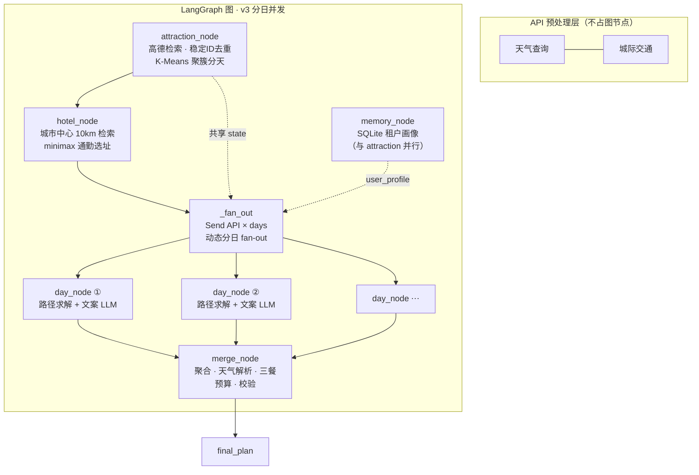

<p align="center">
  
</p>

<p align="center">
  
  
  
  
  
</p>

# 🧳 TripPlanner

> **多日旅行规划 AI Agent** —— 确定性优先 · LLM 最小职责 · 数据层互斥

输入 `出发地 + 目的地 + 天数 + 偏好`，输出**完整行程**：景点顺序、到离时间、全程酒店、真实三餐、预算与天气。规划过程真 SSE 流式可见，每一步降级透明。

---

## 🏗️ 架构总览



### 关键设计

| | 设计 | 说明 |
|---|------|------|
| 🔒 | **数据层互斥** | K-Means 聚簇分天，每个 POI 只属一天——跨天重复在结构上不可能发生，LLM 不再做全局去重推理 |
| ⚡ | **动态并行** | Send API 按 `days` 运行时 fan-out N 个并行 day 节点，实测 4 路并行时延 ≈ 单路 |
| 🧭 | **路径本地求解** | 贪心最近邻 + 2-opt + 时间窗硬检查（Haversine × 绕路系数），零 API 调用；≤8 节点按规模选型不上求解器 |
| 🏨 | **目标函数选址** | 全程酒店按 minimax 通勤距离对真实候选打分（替代几何质心——离群敏感且无业务语义） |
| ✍️ | **LLM 最小职责** | 每天一次文案调用（JSON mode），只写 description/tips；失败本地模板兜底，计划永不中断 |
| 📚 | **攻略知识库（RAG）** | 手写 BM25 检索 30 篇小红书风攻略注入文案 prompt（引用可溯源）；确定性 query 不上向量库 |
| 🧠 | **记忆统计信号** | SQLite 租户隔离 + 频率加成 / IQR 异常检测，画像渐进构建（≥5 次行程才启用） |
| 🛡️ | **韧性** | SQLite checkpoint 断点续传 · LLM 指数退避 · SSE 断开取消 · MCP 超时 · 全局并发闸(10) 防 QPS 打爆 |

---

## 🚀 快速启动

```bash
# 1. 后端环境
cd backend
python3 -m venv venv && source venv/bin/activate
pip install -r requirements.txt

# 2. API Key（高德地图 + DeepSeek）
cp .env.example venv/.env && nano venv/.env

# 3. 一键启动（后端 :8000 + 前端 :5173）
cd .. && bash start.sh
```

打开 <http://localhost:5173>，输入城市与偏好即可体验。

---

## 🧪 测试

```bash
cd backend && ./venv/bin/python -m pytest tests -q
```

**60 个用例 · 无网络 · 无 LLM**（Fake 组件注入：FakeAmapWrapper / FakePlanner / FakeRepository）。
测试基线一次捕获过 5 个真实 bug：LangGraph fan-in 双触发、MCP 工具名错误、POI 无坐标、
画像 None 击穿、LLM 幻觉坐标（偏差 1300km）。

---

## 📁 项目结构

```
backend/
├── app/
│   ├── api/trip.py            # POST /api/trip + GET /api/trip/stream（真 SSE）
│   ├── graph/                 # LangGraph：builder / nodes / state / context / events
│   ├── services/
│   │   ├── clustering.py      # 手写 K-Means（k-means++）聚簇分天
│   │   ├── route_solver.py    # 贪心最近邻 + 2-opt + 时间窗
│   │   ├── amap_service.py    # 全局 MCP 并发闸 + geo 缓存(LRU)
│   │   ├── guide_rag.py       # 手写 BM25 攻略知识库检索（RAG）
│   │   └── llm_service.py     # DeepSeek 封装 + 指数退避
│   ├── tools/amap_wrapper.py  # 高德 MCP 包装（结构化候选 + 坐标增强）
│   ├── memory/                # 分类器 / MemoryManager / SQLite 仓库
│   └── agents/                # day_agent（单天文案，JSON mode）
├── tests/                     # 60 用例（全 Fake 注入）
└── data/                      # 运行时数据（gitignored）
frontend/                      # Vue 3 单文件 · SSE 流式进度 · 降级面板
```

---

## 📈 版本演进

| 版本 | 架构 | LLM 调用 |
|------|------|----------|
| **v1**（master） | ReAct 内循环，4 感知 Agent 共享 MCP | 3 次/请求 |
| **v2**（preview） | attraction/hotel 改确定性检索节点 | 1 次/请求 |
| **v3**（preview） | Send 分日并行 + 数据层互斥 + 路径/选址本地化 | N 次文案/请求（并行，时延 ≈ 1 次） |

git log 的迭代提交就是完整演进证据：`isolate requests → 结构化候选链路 → 分日并发重构`。
