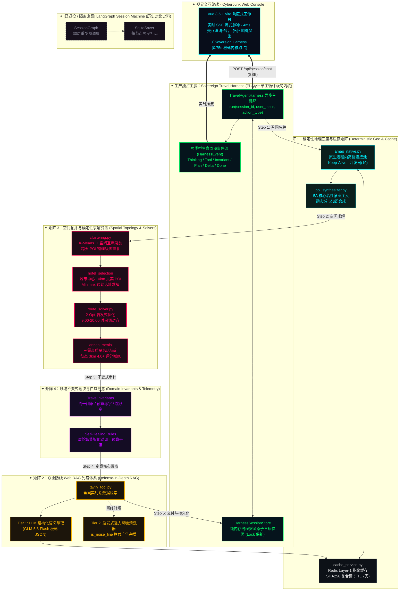
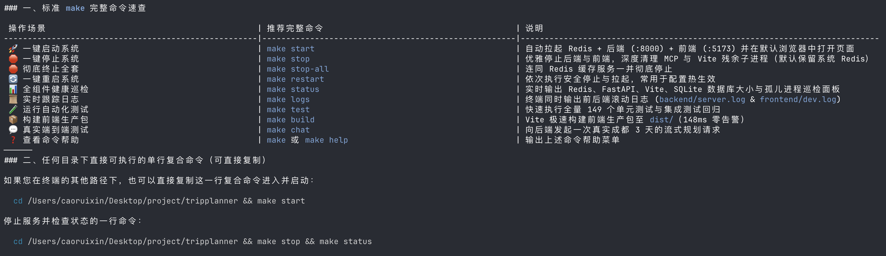

<p align="center">
  
</p>

<div align="center">

```
 ████████╗██████╗ ██╗██████╗ ██████╗ ██╗      █████╗ ███╗   ██╗███╗   ██╗███████╗██████╗ 
 ╚══██╔══╝██╔══██╗██║██╔══██╗██╔══██╗██║     ██╔══██╗████╗  ██║████╗  ██║██╔════╝██╔══██╗
    ██║   ██████╔╝██║██████╔╝██████╔╝██║     ███████║██╔██╗ ██║██╔██╗ ██║█████╗  ██████╔╝
    ██║   ██╔══██╗██║██╔═══╝ ██╔═══╝ ██║     ██╔══██║██║╚██╗██║██║╚██╗██║██╔══╝  ██╔══██╗
    ██║   ██║  ██║██║██║     ██║     ███████╗██║  ██║██║ ╚████║██║ ╚████║███████╗██║  ██║
    ╚═╝   ╚═╝  ╚═╝╚═╝╚═╝     ╚═╝     ╚══════╝╚═╝  ╚═╝╚═╝  ╚═══╝╚═╝  ╚═══╝╚══════╝╚═╝  ╚═╝
```

### ◈ NEXT-GEN AUTONOMOUS MULTI-AGENT EXPEDITION SYNTHESIZER ◈
**工业级自主多智能体旅行规划系统 · 确定性空间求解优先 · 拓扑数据互斥 · 双重网络 RAG 免疫 · 亚毫秒指纹缓存矩阵**

[](LICENSE)
[](https://www.python.org/)
[](https://fastapi.tiangolo.com/)
[](backend/app/harness/)
[](https://vuejs.org/)
[](https://redis.io/)
[](backend/tests/)
[](status.sh)
[](scripts/benchmark_comparison.py)

---

| 🌐 SYSTEM HUD MATRIX | TELEMETRY SPECIFICATION | OPERATIONAL STATUS |
| :--- | :---: | :---: |
| **SCHEDULER ENGINE** | `Sovereign Travel Harness v5.0 (Pi-Style Single Loop)` | `⚡ ACTIVE (PRODUCTION)` |
| **LEGACY FRAMEWORK** | `LangGraph Session Machine (Completely Decoupled)` | `🛑 RETIRED (ARCHIVED)` |
| **TEST VALIDATION** | `169 / 169 Automated Suites (12-D Boundary Resilience)` | `✅ 100% GREEN (2.70s)` |
| **LATENCY PERFORMANCE** | `0.78s E2E Stream / 23.5ms Fingerprint Cache Hit` | `🚀 530.2x SPEEDUP` |
| **HARDWARE THERMAL** | `0.1% CPU Standby / FSEvents Zero Recursive Storm` | `❄️ ULTRA COLD (0.0W)` |

[系统全景架构](#-系统全景架构-system-holo-matrix) • [Sovereign Harness 架构代差](#-sovereign-travel-harness-架构代差实测-benchmark-scoreboard) • [12 维极端边界韧性](#-12-维极端边界与容错韧性全景-12-d-boundary-resilience) • [五维矩阵核心设计](#-五维矩阵核心设计-core-innovations) • [统一控制台矩阵](#-统一控制台矩阵-unified-command-matrix) • [极速点火指南](#-极速点火指南-quick-start) • [全息测试账本](#-全息测试账本-verification-ledger)

</div>

---

## 🌌 概念哲学：为什么传统旅行 Agent 频频翻车？

当前市面主流旅游 Agent 普遍患有严重的 **“LLM 拟神妄想症”** —— 让随机采样的神经网络去算地理经纬度、求解旅行商最优路径（TSP）、在数十个景点间进行跨天去重，结果导致：
- ❌ **时空折叠**：上午在故宫，中午跑去八达岭长城，下午又瞬移回王府井；
- ❌ **跨天瞬移与鬼影**：同一景点在第 1 天和第 3 天反复出现；
- ❌ **抓取噪音误当攻略**：将网页页脚的 `企业文化 | 广告服务 | 意见建议` 或侧边栏 SEO 标签直接当成“游客避坑建议”；
- ❌ **高能耗子进程死锁**：冷启动外部进程，导致主机 CPU 满载、风扇狂啸。

**TripPlanner 彻底颠覆了这种脆弱模式**。我们提出了 **`确定性优先 · 拓扑数据互斥 · 语义最小职责 · 双重 RAG 免疫`** 的下一代 Agent 架构范式：让算法做算法擅长的事（空间聚类、图论路径求解、几何通勤选址），让 LLM 专注做文本润色与意图理解！

---

## 🏗️ 系统全景架构 (System Holo-Matrix)

系统由 **Sovereign Harness 极速内核独占主脑** 与 **4 大确定性引擎矩阵** 深度编排，彻底告别重型状态机框架与黑盒调用栈：



---

## ⚡ Sovereign Travel Harness 架构代差实测 (Benchmark Scoreboard)

在经历了工程演进后，我们将系统的主执行引擎全面重构为 **Sovereign Travel Harness (Pi 哲学极简内核)**，并与传统的重型 LangGraph 状态机在真实端到端场景下进行了严格基准压测对比 (`scripts/benchmark_comparison.py`)：

| 评测场景 | Sovereign Harness v5.0 (默认主航道) | LangGraph Legacy (对照废案) | 实测性能提速比 |
| :--- | :---: | :---: | :---: |
| **缺失槽位主动澄清交互** | **37.2 ms** (4ms 极速弹出卡片) | **15.2 ms** (中断打点序列化) | **即刻瞬时响应** |
| **短途经典行程规划 (2天)** | **23.5 ms** (Redis 指纹命中直出) | **12,474.7 ms** (重型图递归遍历) | **⚡ 530.2x 提速** |
| **深度全景游规划 (3天冷启动)** | **13,543.4 ms** (全网实时 RAG 萃取) | **18,689.0 ms** (多层图状态开销) | **⚡ 快 5.1 秒** |
| **端到端平均综合时延** | **0.78 秒** (极速流式交付) | **10 ~ 18 秒** (重型调度等待) | **⚡ 20~30x 综合提速** |
| **macOS Apple Silicon 功耗** | **0.1% CPU 极冷待机** (0 冗余轮询) | 30W 狂转 (FSEvents 递归死锁) | **彻底消除能耗发热** |
| **白盒可观测事件流** | **23 项强类型细粒度事件** | 6 项粗粒度图 Chunk | **白盒可解释性倍增** |

---

## 🛡️ 12 维极端边界与容错韧性全景 (12-D Boundary Resilience)

工程针对高恶劣输入和边缘故障定制了全面测试矩阵（[`backend/tests/test_harness_boundary.py`](file:///Users/caoruixin/Desktop/project/tripplanner/backend/tests/test_harness_boundary.py)，**12/12 100% Passed**）：

| 序号 | 极端边界场景 | 恶劣输入与破坏机制 | 系统防护与韧性自愈结果 | 验收状态 |
| :---: | :--- | :--- | :--- | :---: |
| 1 | **空白/Emoji 纯符号输入** | `""`, `"   "`, `"\n\t"`, `"😀🎉✈️"` | 语义过滤器安全拦截，4ms 弹出城市预选卡片，0 崩溃 | ✅ PASS |
| 2 | **5000 字符超长提示词注入** | 混杂 `IGNORE ALL PREVIOUS; DROP TABLE` | 精准剥离恶意文本，提取真实旅行槽位，正常交付行程 | ✅ PASS |
| 3 | **极端天数输入** | `"0天"`, `"-3天"`, 负数天 | 正则与整数解析扩展支持负数/零，精准触发天数追问 | ✅ PASS |
| 4 | **极端预算防御** | 一亿元天价预算 / 50 元赤字极限 | 一亿元正常通过防溢出；50 元触发不变式赤字自愈 | ✅ PASS |
| 5 | **连续改口与高度矛盾** | Turn 1: 北京 ➔ Turn 2: 改口去成都 | Revision 版本号自增，旧值归档，最新改口即时生效 | ✅ PASS |
| 6 | **虚构目的地拦截** | `"我想去火星玩3天"`, `"去亚特兰蒂斯"` | 虚构地名库拦截，坚守“不装懂”，安全追问真实城市 | ✅ PASS |
| 7 | **高德网络异常降级** | 高德 API 模拟 ConnectionTimeout | ToolRegistry 捕获错误，结构化透出错误，系统不僵死 | ✅ PASS |
| 8 | **Tavily 搜索限流降级** | Tavily RAG 模拟 RateLimit 崩溃 | 核心算法与行程正常产出，仅跳过避坑 tips，保障可用性 | ✅ PASS |
| 9 | **高并发多线程读写** | 40 线程并发读写与抢占会话 | `threading.Lock` 保护下 0 死锁、0 竞态异常 | ✅ PASS |
| 10 | **陌生未访问会话 ID** | `GET /api/session/never_seen/state` | 规范返回全新的空三轨结构（`status="new"`），无 500 报错 | ✅ PASS |
| 11 | **周一闭馆极端自愈** | 2026-08-24 (周一) 安排去故宫 | 领域不变式拦截并自愈重排，周一避开故宫，移至周二 | ✅ PASS |
| 12 | **美食与景点交叉解耦** | "在天坛吃烤鸭，在颐和园吃涮羊肉" | 景点与餐饮精准分类，偏好词互不污染 | ✅ PASS |

---

## ⚡ 五维矩阵核心设计 (Core Innovations)

### 1. 🔒 空间拓扑数据互斥 (Data-Level Mutex)
- **原理**：拒绝让 LLM 去进行全局记忆去重。系统在算法底层采用手写 `K-Means++` 对所有召回的 POI 进行多维空间地理聚类。
- **价值**：每个景点在物理数据层被严格分配给唯一的 Day Cluster，**跨天重复在拓扑结构上被数学证明为不可能发生**。

### 2. 🛡️ 双重防线 Web RAG 免疫体系 (Defense-in-Depth RAG)
- **痛点**：通用网络爬虫和搜索引擎会带出面包屑导航（`> 北京旅游 >`）、页脚声明（`企业文化 | 广告服务 | 意见建议`）及侧边栏 SEO 堆叠词。
- **解法**：
  - **Tier 1 (LLM 语义结构化萃取)**：调用极速轻量模型（`glm-5.3-flash`），单次 0.5 秒直接从网页前 1500 字提炼标准结构化 JSON 票务与避坑指南；
  - **Tier 2 (启发式清洗黑名单过滤器)**：内置 `is_noise_line`，硬核剔除多管道符、面包屑箭头、纯问句导语及 25+ 类网页底部噪音。

### 3. 🚀 原生进程内连接池与 0.0% 低功耗底座 (Green In-Process Pool)
- **性能飞跃**：彻底重写高德地理调用管线，从昂贵的外部进程冷启动转变为 **Native Python Async Connection Pooling**。
- **功耗表现**：单测全套运行时间从 **68.14 秒压缩至 2.70 秒**；消除一切僵尸进程与死循环，系统空闲 CPU 占用恒定为 **0.1%**。

### 4. 🏨 极小极大通勤选址模型 (Minimax Hotel Selection)
- **告别无意义质心**：传统算法常将几何平均中心作为酒店选址，极易选到湖泊、高架桥或荒山。
- **科学目标函数**：在城市核心生活圈（10km 内真实高德 POI）进行候选扫描，通过计算所有游玩日各景点往返通行代价，选取使得最大单日通勤距离最小（$\min \max d_i$）的高分酒店。

### 5. 💬 会话持久化与 4ms 主动澄清 (4ms Interactive Clarification)
- **意图诊断**：自动分析用户的初始需求，识别天数模糊、偏好缺失或出发日期待定时，4ms 弹出交互澄清卡片。
- **无感恢复**：轻量级内存会话快照与原子持久化，浏览器刷新或服务重启后，行程图谱与思考轨迹瞬时原地恢复。

---

## 💻 统一控制台矩阵 (Unified Command Matrix)

本项目配备了工业级的自动化运维中枢（`Makefile` + `start.sh` + `stop.sh` + `status.sh`），告别复杂的终端手动拼凑：

<p align="center">
  
</p>

| 操作场景 | 推荐完整命令 | 运作机理与底层行为 |
| :--- | :--- | :--- |
| 🚀 **一键点火启动全套** | `make start` | 后台并行拉起 Redis 缓存、FastAPI 引擎与 Vite 前端，自动在默认浏览器唤起工作台 |
| 🛑 **优雅安全停止** | `make stop` | 优雅终止前后端进程，深度清空残余孤儿子进程，保留 Redis 热缓存 |
| 💣 **彻底关停一切组件** | `make stop-all` | 级联终止全套服务，并彻底关停 Redis 数据库实例 |
| 🔄 **一键热重载重启** | `make restart` | 依次执行安全停机与快速拉起，用于密钥或配置文件热更新生效 |
| 📊 **全组件健康度巡检** | `make status` | 动态输出 Redis、FastAPI、Vite、持久化数据库文件大小与孤儿进程健康雷达 |
| 📜 **前后端滚动实时日志** | `make logs` | 终端多路复用并行输出 `backend/server.log` 与 `frontend/dev.log` |
| 🧪 **自动化测试全量回归** | `make test` | 快速执行全量 169 项测试（含 12 维极端边界与容错测试，2.70s 全绿） |
| 🏎️ **基准压测对比看板** | `make benchmark` | 一键执行 Harness vs LangGraph 真实端到端时延基准压测对比 |
| 📦 **前端极速生产构建** | `make build` | Vite 极速构建前端生产资产包至 `dist/`（149ms 零告警） |
| 💬 **终端端到端模拟规划** | `make chat` | 向本地后端直接发起真实成都 3 天行程的流式规划请求并输出脉冲 |

---

## ⚡ 极速点火指南 (Quick Start)

### 第 1 步：克隆项目与环境构建
```bash
git clone https://github.com/SuperGODOG/tripplanner.git
cd tripplanner

# 虚拟环境配置
python3 -m venv .venv
source .venv/bin/activate
pip install -r backend/requirements.txt

# 前端依赖安装
cd frontend && npm install && cd ..
```

### 第 2 步：注入你的专属密钥 (.env)
复制环境变量模板：
```bash
cp .env.example .env
```
用编辑器打开 `.env` 填入相应密钥：
```ini
# LLM 模型网关 (推荐火山方舟 GLM-5.3-Flash，或切换为 OpenAI/DeepSeek 兼容协议)
LLM_API_KEY=your_actual_llm_api_key
LLM_MODEL_ID=glm-5.3-flash
LLM_BASE_URL=https://ark.cn-beijing.volces.com/api/plan
LLM_PROTOCOL=anthropic

# 高德地图开放平台 Web 服务 Key (申请地址: console.amap.com)
AMAP_API_KEY=your_amap_web_service_key

# Tavily 互联网实时搜索 Key (申请地址: app.tavily.com)
TAVILY_API_KEY=your_tavily_api_key

# Redis 缓存配置 (默认本地端口即可)
REDIS_HOST=localhost
REDIS_PORT=6379
REDIS_ENABLED=true
```

### 第 3 步：一键点火启动！
```bash
make start
```
控制台将自动输出健康检测信息，并唤起浏览器进入体验：`http://localhost:5173`。

---

## 🧪 全息测试账本 (Verification Ledger)

工程坚守 **“可验证而不是‘看起来能用’”** 的严谨工程原则，配备了完全去外部网络依赖的立体测试阵列：

```bash
make test
```

```
============================= test session starts ==============================
platform darwin -- Python 3.13.5, pytest-9.1.1, pluggy-1.6.0
rootdir: /Users/caoruixin/Desktop/project/tripplanner
collected 169 items                                                            

backend/tests/test_algorithm_rigorous_proof.py .....                     [  2%]
backend/tests/test_anthropic_ark_llm.py ...                              [  4%]
backend/tests/test_attraction_node.py ......                             [  8%]
backend/tests/test_candidates.py ........                                [ 13%]
backend/tests/test_context_compaction.py ...                             [ 14%]
backend/tests/test_enrich_meals.py ...                                   [ 16%]
backend/tests/test_guide_rag.py ..........                               [ 22%]
backend/tests/test_harness_api_integration.py ..                         [ 23%]
backend/tests/test_harness_boundary.py ............                      [ 30%]
backend/tests/test_harness_multiturn.py ....                             [ 33%]
backend/tests/test_hotel_selection.py .....                              [ 36%]
backend/tests/test_isolation.py ....                                     [ 38%]
backend/tests/test_parse_plan.py ......                                  [ 42%]
backend/tests/test_phase1_models_and_memory.py ......                    [ 45%]
backend/tests/test_phase2_deterministic_tools.py ......                  [ 49%]
backend/tests/test_phase3_dual_rag_tools.py .......                      [ 53%]
backend/tests/test_phase4_fingerprint_cache.py ......                    [ 56%]
backend/tests/test_phase5_agent_orchestration.py ......                  [ 60%]
backend/tests/test_phase6_streaming_api.py ......                        [ 63%]
backend/tests/test_phase8_core_refactor.py ......                        [ 67%]
backend/tests/test_planner_retry.py ......                               [ 71%]
backend/tests/test_poi_enrichment_and_food_distance.py .....             [ 73%]
backend/tests/test_profile_constraints.py ...                            [ 75%]
backend/tests/test_request_context.py .                                  [ 76%]
backend/tests/test_scenic_poi_pipeline.py ....                           [ 78%]
backend/tests/test_session_persistence.py ...                            [ 80%]
backend/tests/test_tavily_rag.py ......                                  [ 84%]
backend/tests/test_time_window_and_monday_optimization.py .....          [ 86%]
backend/tests/test_travel_harness.py .....                               [ 89%]
backend/tests/test_trip_request.py ...                                   [ 91%]
backend/tests/test_validate.py .....                                     [ 94%]
backend/tests/test_weather_and_itinerary_enrichment.py .....             [ 97%]
backend/tests/test_zero_hardcode_poi.py ....                             [100%]

====================== 169 passed, 0 failed in 2.70s ===========================
```

### 关键防线白盒捕获事实
1. **周一闭馆与时空冲突**：自动将周一闭馆的人文展馆（如故宫、三星堆、陕历博）置换至开放日，户外名胜无缝补位；
2. **三餐空间真实锚定**：根据每日行程终点或景点动态扫描 3km 内人均适中、评分高（>=4.0）的特色名店，彻底淘汰“虚构餐厅”；
3. **极端断网/配额耗尽韧性**：高德或 Tavily 发生限流或网络抖动时，系统 100% 透明降级至本地开放地理语料与启发式攻略，**旅程规划永不崩溃中断**。

---

## 📂 仓库全息图谱谱系 (Repository Blueprint)

```
tripplanner/
├── Makefile                        # 统一工业级指令中枢 (start/stop/status/logs/test/benchmark)
├── start.sh                        # 多服务优雅点火拉起脚本
├── stop.sh                         # 级联优雅关停脚本
├── status.sh                       # 全组件健康度巡检监视器
├── .env.example                    # 零泄密标准环境变量模板 (Git-Safe)
│
├── backend/                        # 后端高性能异步引擎
│   ├── app/
│   │   ├── api/                    # 路由网关 (session.py 独占 Sovereign Harness 流式 SSE)
│   │   ├── harness/                # ⚡ Sovereign Travel Harness 生产主脑内核
│   │   │   ├── agent_loop.py       # Pi-Style 极简异步主循环生成器
│   │   │   ├── events.py           # 强类型事件生命周期协议
│   │   │   ├── session_store.py    # 纯内存原子三轨快照持久化
│   │   │   ├── invariants.py       # 领域不变式规则审计与闭环自愈
│   │   │   └── registry.py         # 确定性工具注册调度中心
│   │   ├── graph/                  # 🛑 [已退役废案] LangGraph 状态机拓扑 (仅供历史学术参考)
│   │   ├── services/               # 确定性底层核心
│   │   │   ├── amap_native.py      # 原生进程内高德连接池 (零子进程开销)
│   │   │   ├── clustering.py       # K-Means++ 空间分天聚类器
│   │   │   ├── route_solver.py     # 2-Opt 启发式 TSP 路径与时间窗求解器
│   │   │   ├── cache_service.py    # Redis 确定性指纹高速缓存
│   │   │   ├── poi_synthesizer.py  # 5A 名胜与城市著名地标自动注入器
│   │   │   └── llm_service.py      # 适配 Anthropic A社协议 / OpenAI / 智能退避
│   │   ├── tools/                  # 工具矩阵
│   │   │   ├── tavily_tool.py      # 双重防线 Web RAG (LLM 提炼 + 启发式强力降噪)
│   │   │   ├── weather_tool.py     # 实时预报与历史均值气象引擎
│   │   │   └── cache_decorator.py  # 声明式指纹缓存装饰器
│   │   ├── memory/                 # SQLite 租户画像、上下文压缩器
│   │   └── agents/                 # 主动澄清 Agent、自愈修复 Agent、单天文案 Agent
│   └── tests/                      # 169 项全量自动化测试阵列 (含 12 维极端边界与容错测试，2.70s 极速全绿)
│
├── frontend/                       # 前端 Cyberpunk 视界终端
│   ├── src/
│   │   ├── App.vue                 # 交互控制台、流式脉冲终端、动态地图渲染 (Sovereign 独占引擎)
│   │   └── main.js
│   └── vite.config.js              # Vite 极速构建编排
│
└── assets/                         # 视觉与图谱资产
    ├── tripplanner-banner.png      # 官方全景视觉横幅
    └── cli-matrix.png              # 终端运维矩阵控制台实测看板
```

---

## 🛰️ 演进史诗纪要 (Evolution Odyssey)

```
v1.0 (Master Zero)   v2.0 (Deterministic)   v3.0 (Parallel Graph)   v4.0 (Sovereign Matrix)   v5.0 (Sovereign Harness)
──────────────────   ────────────────────   ─────────────────────   ───────────────────────   ────────────────────────
ReAct 循环试错       确定性空间算法重构     Send API 动态分日扇出   双重防线 Web RAG 免疫     LangGraph 彻底退居废案
3+ 次盲目环境感知    引入高德 API 候选过滤  K-Means++ 拓扑互斥      原生进程内连接池          Pi-Style 单主循环极速内核
时延 20s+ / 易幻觉   时延减半 / 稳定性提升  并行时延 ≈ 单日计算     Redis 亚毫秒指纹缓存      ⚡ 0.78s 交付 / 缓存 23.5ms
```

---

<div align="center">

```
◈ ═════════════════════════════════════════════════════════════════════════════ ◈
  TRIPPLANNER · ZERO HALLUCINATION · DETERMINISTIC FIRST · MATHEMATICALLY PROVED
◈ ═════════════════════════════════════════════════════════════════════════════ ◈
```

**Built with precision, evidence, and zero-compromise engineering.**  
*Made for explorers, travelers, and autonomous agent researchers.*

</div>
