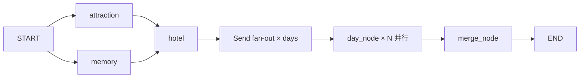

# TripPlanner 项目总览

> Multi-Agent Trip Planner — 基于 LangGraph + 高德 MCP 的旅行规划系统（v3：分日并行 + 数据层互斥）

_精简版；架构图见 [`ARCHITECTURE.md`](../ARCHITECTURE.md)。_

---

## 一、一句话描述

输入**出发地 + 目的地 + 天数 + 偏好** → 输出**完整行程**（景点顺序/时间/酒店/三餐/预算/天气），全程**分日并行**生成，跨天景点互斥在**数据层**保证——每个 POI 只属一天，跨天重复在结构上不可能。

## 二、技术栈

| 组件 | 选型 | 定位 |
|------|------|------|
| 编排引擎 | LangGraph StateGraph (1.2) | 图编排 + Send API 动态并行 |
| LLM | DeepSeek | 单天文案生成（自研 LLM 封装层） |
| 地图数据 | 高德 MCP（amap-mcp-server） | 景点/酒店/天气/距离检索 |
| Web 框架 | FastAPI + Pydantic v2 | REST API + 真 SSE 流式 |
| Checkpoint | SqliteSaver | 断点续传（`data/checkpoints.db`） |
| 记忆 | SQLite | 租户隔离 + 渐进画像持久化 |
| 前端 | Vue 3 + Vite | 单文件应用，SSE 逐帧渲染 |

## 三、图拓扑（v3：全图无回环）



- `attraction / memory` 并行（检索 + 画像互不依赖）→ `hotel` 选址 → **Send API 按天动态 fan-out** → `day_node × N` 并行生成单日行程 → `merge_node` 聚合校验 → END
- **无回环**：v2 的 retry_planner/retry_hotel 已删——景点集合/顺序/预算全部本地确定，硬伤在结构上不可能由 LLM 引入；文案失败只降级不重试

## 四、六层职责

```
第 6 层  API 端点         ← GET /api/trip/stream（真 SSE 流式，前端主路径）；POST /api/trip 保留
第 5 层  图编排           ← LangGraph StateGraph + Send API 按天 fan-out（graph/builder.py）
第 4 层  确定性节点       ← attraction/hotel 直连高德 MCP：检索/坐标增强/聚簇/选址全本地，无 LLM
第 3 层  文案 Agent       ← day_agent 单天 JSON mode（每天一次 LLM，失败本地模板兜底）
第 2 层  LLM 封装         ← 自研 LLM 封装层：DeepSeek 调用 + 指数退避重试 + JSON mode 透传
第 1 层  API 预处理       ← 天气 _fetch_weather() + 城际 _compute_intercity() + 日期本地计算（不占图 Node）
```

## 五、核心设计亮点

| 关注点 | 方案 | 代码位置 |
|--------|------|---------|
| **数据层互斥** | K-Means 聚簇分天：每个 POI 只属一天，跨天重复在结构上不可能（LLM 不再承担全局去重推理——幻觉高发根源） | `services/clustering.py` |
| **动态并行** | Send API 按 days 运行时 fan-out；实测 4 路并行时延 ≈ 单路串行 | `graph/builder.py` |
| **Send 语义** | 分支 state 只含 payload（共享上下文显式注入）；汇聚只触发 1 次（与跨 superstep fan-in 双触发是不同语义） | `graph/builder.py` |
| **路径本地求解** | 贪心最近邻 + 2-opt + 时间窗硬检查（Haversine × 绕路系数 1.4），零 API 调用；按规模选型不上 OR-Tools | `services/route_solver.py` |
| **目标函数选址** | minimax 通勤替代几何质心（质心离群敏感且无业务语义）；远郊点排除参与 + 经济型偏好过滤候选池 | `graph/nodes.py` |
| **LLM 最小职责** | 每天一次文案（JSON mode）；失败本地模板兜底，计划永不中断 | `agents/trip_planner_agent.py` |
| **记忆** | SQLite 租户隔离 + 频率加成/IQR 异常检测 + 渐进画像（≥5 次启用） | `memory/` |
| **韧性** | checkpoint 断点续传 / LLM 退避重试 / SSE 断开取消 / MCP 超时保护 / 全局并发闸（max_workers=10） | 多层落地 |

## 六、测试与质量

- **60 用例，无网络无 LLM**：FakeAmapWrapper / FakePlanner 注入 + InMemorySaver，覆盖分日互斥、路径求解、文案兜底、乱序聚合、偏好路由、RAG 检索等
- 基线实测抓过 **5 个真实 bug**：
  1. 跨 superstep fan-in 双触发（planner 每请求跑两遍）
  2. `maps_around_search` 工具名错误（around 路径静默失败）
  3. 高德 MCP 返回 POI 无坐标（缺 geo 增强则候选全丢）
  4. 画像键存在值为 None 击穿（`"经济型" in None` 崩溃）
  5. LLM 幻觉坐标偏差 1300km（v3 坐标全部本地组装，幻觉源在结构上消除）

## 七、版本演进

| 版本 | 架构 | LLM 调用 |
|------|------|---------|
| v1（master） | ReAct 4 Agent 内循环 + LangGraph 分层 | 全程参与 |
| v2 | attraction/hotel 变确定性节点，ReAct 只剩 planner | 3 → 1 次/请求 |
| **v3（preview，当前）** | **分日并行 + 数据层互斥 + 路径本地求解** | **只剩文案（每天 1 次，N 路并行时延 ≈ 1 次串行）** |

## 八、项目结构

```
tripplanner/
├── README.md                    # 项目入口 + 快速部署
├── CLAUDE.md                    # 项目备忘录（Claude Code 自动读取）
├── ARCHITECTURE.md              # Mermaid 架构图
├── docs/                        # 详细文档
│   ├── OVERVIEW.md              # 本文件
│   └── technical-notes/         # 深入技术设计
├── backend/
│   ├── app/
│   │   ├── config.py            # 配置管理（pydantic-settings + .env）
│   │   ├── models/              # schemas.py（请求/响应）+ candidates.py（POI 结构化候选）
│   │   ├── agents/
│   │   │   └── trip_planner_agent.py  # 自研 LLM 封装 + day_agent（单天文案 JSON mode）
│   │   ├── services/
│   │   │   ├── llm_service.py         # LLM 单例 + 指数退避重试
│   │   │   ├── amap_service.py        # 高德 MCP 全局并发闸 + geo 缓存（LRU）
│   │   │   ├── clustering.py          # K-Means 聚簇分天（数据层互斥）
│   │   │   └── route_solver.py        # 贪心最近邻 + 2-opt + 时间窗硬检查
│   │   ├── tools/
│   │   │   └── amap_wrapper.py        # MCP 3 层封装（MCP→Format→Validate）
│   │   ├── graph/
│   │   │   ├── state.py               # TripPlannerState（Annotated[list, add] error_log）
│   │   │   ├── nodes.py               # attraction/hotel/day_node/merge 节点
│   │   │   ├── builder.py             # StateGraph + Send fan-out + SqliteSaver
│   │   │   ├── context.py             # RequestContext（thread_id 等）
│   │   │   └── events.py              # SSE 事件发射器
│   │   ├── memory/
│   │   │   ├── models.py, repository.py, classifier.py, manager.py  # SQLite 租户隔离 + 画像
│   │   └── api/
│   │       ├── main.py, trip.py       # FastAPI + GET /api/trip/stream（真 SSE）
│   ├── data/                          # checkpoints.db + 记忆 SQLite
│   └── run.py
└── frontend/                          # Vue 3 单文件 App.vue（真 SSE 流式）
```

## 九、前端

Vue 3 单文件应用。主路径消费 `GET /api/trip/stream` **真 SSE**（fetch + ReadableStream 逐帧解析，`data:` 行 JSON），按节点事件推进进度并渲染结果——**已删除 setInterval 假进度条**。

## 十、快速部署

见 [`README.md`](../README.md#-快速部署)。

## 十一、扩展文档索引

| 想看什么 | 去哪里 |
|---------|--------|
| 项目主页 / 部署 | [`README.md`](../README.md) |
| 架构图（Mermaid） | [`ARCHITECTURE.md`](../ARCHITECTURE.md) |
| Claude Code 项目备忘录 | [`CLAUDE.md`](../CLAUDE.md) |
| 分布式容错评估 | [`docs/technical-notes/interrupt-resilient-design.md`](technical-notes/interrupt-resilient-design.md) |
